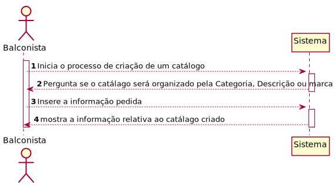
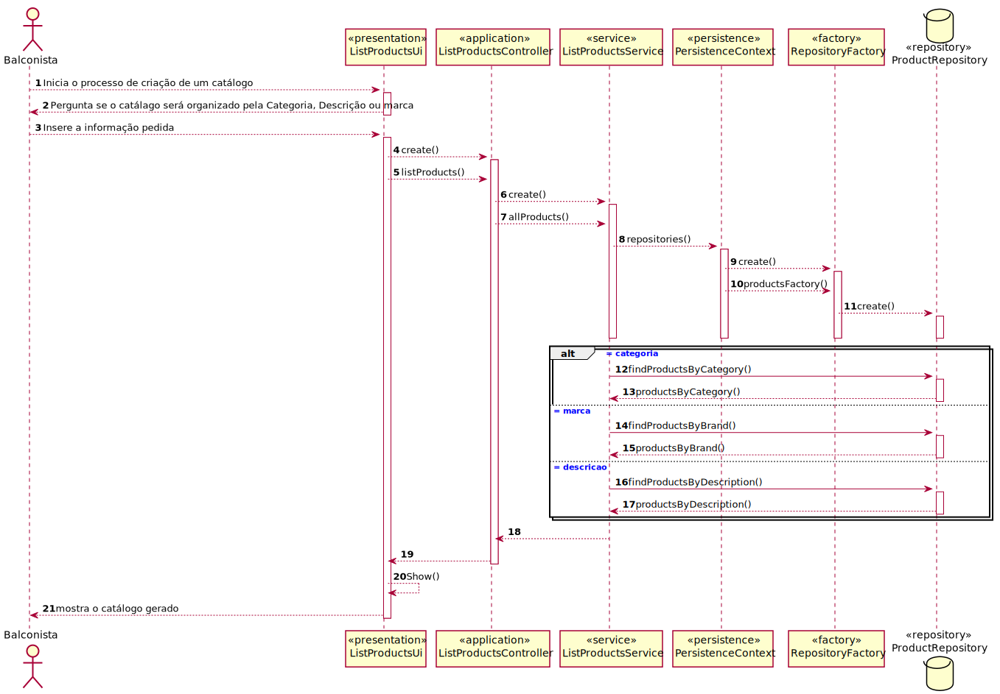
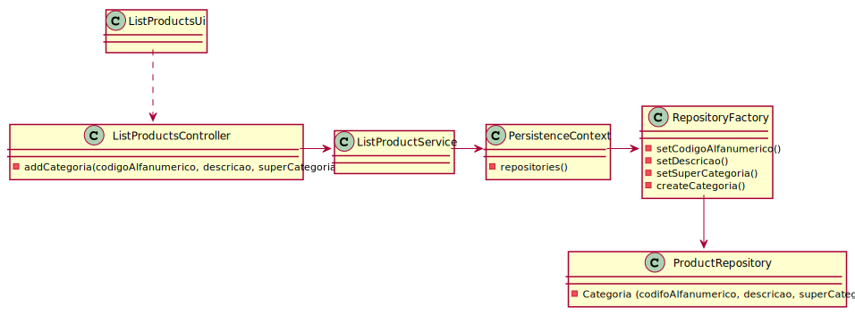

# US1002 - Como Balconista de Vendas, quero visualizar/pesquisar o catálogo de produtos.
=======================================

# 1. Requisitos

**US1002** Como {Balconista} pretendo...

- US1002.1 - visualizar o catálogo de produtos.
- US1002.2 - pesquisar o catálogo de produtos.

A interpretação feita deste requisito foi a seguinte:

Como sou um balconista, ou seja, um ator do sistema, precisso acessar ao sistema para poder vizualizar e pesquisar os produtos, os produtos, que estão organizados em categoria.

### 1.1 Especificações e esclarecimentos do cliente

> [Question:](https://moodle.isep.ipp.pt/mod/forum/discuss.php?d=15690)
> Dear client, Regarding the product search, is there a field you want to use to filter the data and any desired data presentation order? And do you want to see all the fields or just a simplified summary?
> Thank you for the time spent,
>
> [Awnser:](https://moodle.isep.ipp.pt/mod/forum/discuss.php?d=15690)
> Commonly fields used to filter products are:
Category
Description (any of the available descriptions)
Brand
User should select/specify a data presentation order. This applies to any similar US.
At least the product' code, short description, brand, category and unit price should be presented.
More details can be presented for a given/selected product at user request.

> [Question:](https://moodle.isep.ipp.pt/mod/forum/discuss.php?d=15712)
>Dear Client,
In the User Story 1002 it is required that the catalog must support filtering and sorting operations by one or more product attributes, but can you be more specific in relation to the catalog sorting?
> [Awnser:](https://moodle.isep.ipp.pt/mod/forum/discuss.php?d=15712)
Please refer to this topic: https://moodle.isep.ipp.pt/mod/forum/discuss.php?d=15690#p20165

> [Question:](https://moodle.isep.ipp.pt/mod/forum/discuss.php?d=15745)
Dear Client,
Should the sales clerk select/specify the catalog presentation order before he/she can see the catalog? Or the catalog is presented in a default order, and then if the sales clerk wants, he/she can change it? The same doubt came on the filtering.
Talking about data presentation orders, which ones should exist?
>
> [Awnser:](https://moodle.isep.ipp.pt/mod/forum/discuss.php?d=15745)
1.Data to be used to filter the products catalog content should be asked ahead. 
2.Regarding presentation order, the necessary data can be asked either: ahead and after presenting them.

# 2. Análise

- Para que este caso de uso fosse realizado foi necesário proceder ao desenvolvimento das US's 1001 e 1005. A US1001 tinha como proposito criar produtos, e como um produto está inserido numa categoria está US também dependia da US1005 cujo propósito é criar categorias para os produtos.

## Excerto do modelo de domínio

# 3. Design

- Para o desenvolvimento dessa US foram aplicados os padrões de 'design' DDD (Domain Drive Design).

## 3.1. Realização da Funcionalidade

### Diagrama de sequência do sistema

### Diagrama de sequência

## 3.2. Diagrama de Classes

## 3.3. Padrões Aplicados

- Controller - ["A utilização do padrão Controller traz como benefício o isolamento das regras de negócios da lógica de apresentação, que é a interface com o usuário. Isto possibilita a existência de várias interfaces com o usuário que podem ser modificadas sem a necessidade de alterar as regras de negócios, proporcionando muito mais flexibilidade e oportunidades de reuso das classes."](https://www.devmedia.com.br/introducao-ao-padrao-mvc/29308#MVC)

- Creator - ["A criação de objetos é uma das mais comuns atividades em um sistema orientado a objetos. Descobrir qual classe é responsável por criar objetos é uma propriedade fundamental da relação entre objetos de classes particulares."](https://pt.wikipedia.org/wiki/GRASP_(padr%C3%A3o_orientado_a_objetos)#Creator_(criador))

- Repository - ["É uma forma de abstrair a persistência de dados. Ele deixa o mecanismo de como os dados são acessados isolados das regras de negócio. Não é a entidade e não é a conexão que faz a persistência, é o repositório, que é uma classe independente com as responsabilidades desacopladas."](https://pt.stackoverflow.com/questions/101692/como-funciona-o-padr%C3%A3o-repository)

- Factory - ["É um padrão de projeto de software (design pattern, em inglês) que permite às classes delegar para subclasses decidirem, isso é feito através da criação de objetos que chamam o método fabrica especificado numa interface e implementado por um classe filha ou implementado numa classe abstrata e opcionalmente sobrescrito por classes derivadas."](https://pt.wikipedia.org/wiki/Factory_Method)

- Persistence Context

## 3.4. Testes
*Nesta secção deve sistematizar como os testes foram concebidos para permitir uma correta aferição da satisfação dos requisitos.*

**Teste 1:** Verificar que não é possível criar uma instância da classe Exemplo com valores nulos.

	@Test(expected = IllegalArgumentException.class)
		public void ensureNullIsNotAllowed() {
		Exemplo instance = new Exemplo(null, null);
	}

# 4. Implementação

- Conforme o ‘design’ feito e com o agregado em questão apara o desenvolvimento desse caso de uso, os sequintes excertos de código abaixo servem para confirmar a veracidade do 'design' proposto.

### List Product Service 

    @ApplicationService
    public class ListProductService {
    
        private final AuthorizationService authz = AuthzRegistry.authorizationService();
        private final ProductRepository productRepository = PersistenceContext.repositories().products();
        private final CategoryRepository categoryRepository = PersistenceContext.repositories().category();
    
        public Product findProductByUniqueInternalCode(UniqueInternalCode code) {
            authz.ensureAuthenticatedUserHasAnyOf(BaseRoles.POWER_USER, BaseRoles.SALES_CLERK);
            return productRepository.findByUniqueInternalCode(code);
        }
    
        public Iterable<Product> findProductByCategory(Category category){
            authz.ensureAuthenticatedUserHasAnyOf(BaseRoles.POWER_USER, BaseRoles.SALES_CLERK);
            return productRepository.findProductsByCategory(category);
        }
    
        public Iterable<Product> findProductByTechnicalDescription(TechnicalDescription technicalDescription){
            authz.ensureAuthenticatedUserHasAnyOf(BaseRoles.POWER_USER, BaseRoles.SALES_CLERK);
            return productRepository.findProductsByDescription(technicalDescription);
        }
    
        public Iterable<Product> findProductByBrand(BrandName brandName){
            authz.ensureAuthenticatedUserHasAnyOf(BaseRoles.POWER_USER, BaseRoles.SALES_CLERK);
            return productRepository.findProductsByBrand(brandName);
        }
    
        public Iterable<Category> findAllCategories(){
            authz.ensureAuthenticatedUserHasAnyOf(BaseRoles.POWER_USER, BaseRoles.SALES_CLERK);
            return categoryRepository.findAll();
        }
    
        public Iterable<TechnicalDescription> findAllTechnicalDescriptions(){
            authz.ensureAuthenticatedUserHasAnyOf(BaseRoles.POWER_USER, BaseRoles.SALES_CLERK);
            return productRepository.findAlltechnicalDescription();
        }
    
        public Iterable<BrandName> findAllBrandNames(){
            authz.ensureAuthenticatedUserHasAnyOf(BaseRoles.POWER_USER, BaseRoles.SALES_CLERK);
            return productRepository.findAllbrandName();
        }

    }

### Product 

    @Entity
    public class Product implements AggregateRoot<Long>, Serializable {

        private static final long serialVersionUID = 1L;
    
        @Version
        private Long version;
    
        @Id
        @GeneratedValue(strategy= GenerationType.AUTO)
        private Long productId;
    
        @Column(unique = true,nullable = false)
        private UniqueInternalCode uniqueInternalCode;
    
        @ManyToOne
        private Category category;
    
        private ShortDescription shortDescription;
    
        private TechnicalDescription technicalDescription;
    
        private ExtendedDescription extendedDescription;
    
        private Double weight;
    
        private Double volume;
    
        private Reference reference;
    
        @Column(unique = true,nullable = false)
        private Barcode barcode;
    
        private BrandName brandName;
    
        @ElementCollection
        private Set<Photo> photos = new HashSet<>();
    
        private ProductionCode productionCode;
    
    
        @Embedded
        @AttributeOverrides({
                @AttributeOverride(name = "amount", column = @Column(name = "no_taxes_amount")),
                @AttributeOverride(name = "currency", column = @Column(name = "no_taxes_currency"))
        })
        private Money priceWithoutTaxes;
    
        @Embedded
        @AttributeOverrides({
                @AttributeOverride(name = "amount", column = @Column(name = "taxes_amount")),
                @AttributeOverride(name = "currency", column = @Column(name = "taxes_currency"))
        })
        private Money priceWithTaxes;
    
    
    
        public Product(final Category category,final UniqueInternalCode uniqueInternalCode, final ShortDescription shortDescription,final ExtendedDescription extendedDescription,final TechnicalDescription technicalDescription,final Barcode barcode,final BrandName brandName, final Reference reference,final Money priceWithoutTaxes, final Money priceWithTaxes, final Double weight, final  Double volume){
            this.category=category;
            this.uniqueInternalCode=uniqueInternalCode;
            this.shortDescription=shortDescription;
            this.extendedDescription=extendedDescription;
            this.technicalDescription=technicalDescription;
            this.priceWithoutTaxes=priceWithoutTaxes;
            this.priceWithTaxes=priceWithTaxes;
            this.weight=weight;
            this.volume=volume;
            this.barcode=barcode;
            this.brandName=brandName;
            this.reference=reference;
        }
    
        protected Product() {
            //for ORM only
        }
    
    
        public void addProductionCode(final ProductionCode productionCode) {
            this.productionCode = productionCode;
        }
    
    
        @Override
        public boolean sameAs(Object other) {
            return DomainEntities.areEqual(this, other);
        }
    
        @Override
        public Long identity() {
            return this.productId;
        }
    
        public UniqueInternalCode uniqueInternalCode() {
            return this.uniqueInternalCode;
        }
    
        @Override
        public String toString() {
            return "Product{" +
                    "version=" + version +
                    ", productId=" + productId +
                    ", uniqueInternalCode=" + uniqueInternalCode +
                    ", category=" + category +
                    ", shortDescription=" + shortDescription +
                    ", technicalDescription=" + technicalDescription +
                    ", extendedDescription=" + extendedDescription +
                    ", weight=" + weight +
                    ", volume=" + volume +
                    ", reference=" + reference +
                    ", barcode=" + barcode +
                    ", brandName=" + brandName +
                    ", photos=" + photos +
                    ", productionCode=" + productionCode +
                    ", priceWithoutTaxes=" + priceWithoutTaxes +
                    ", priceWithTaxes=" + priceWithTaxes +
                    '}';
        }
    
        public Category category(){
            return this.category;
        }
    
        public BrandName brandName(){
            return this.brandName;
        }
    
        public TechnicalDescription technicalDescription(){
            return  this.technicalDescription;
        }
    }
# 5. Integração/Demonstração

* Essa funcionalidade teve de ser integrada com outro agregado criado posteriormente, a Categoria.  

