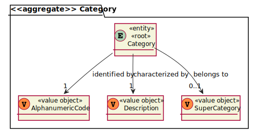
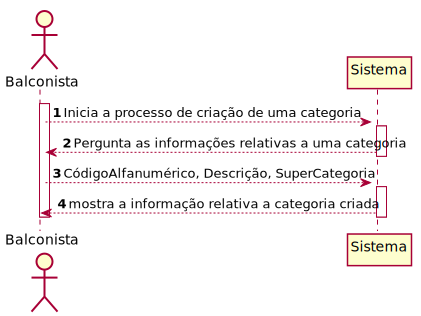
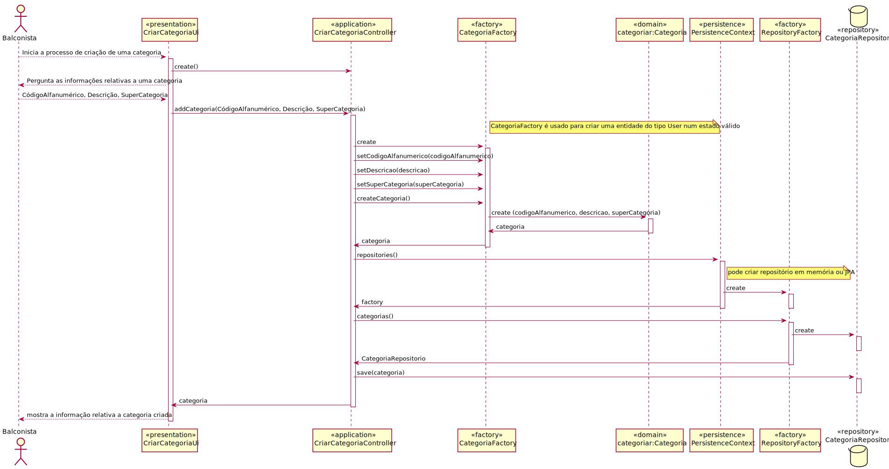
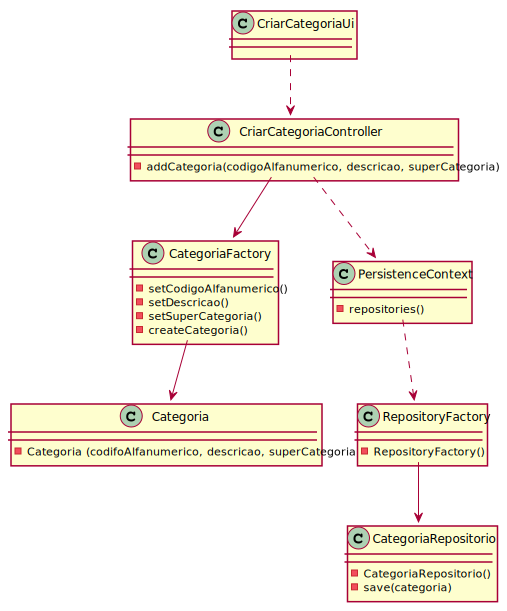

# US1005 -Como Balconista, quero definir uma nova categoria de produtos.
=======================================

# 1. Requisitos

**US1005** Como {Balconista} pretendo...

- US1005.1- definir uma nova categoria de produtos 

A interpretação feita deste requisito foi a seguinte:

Como sou um balconista, ou seja, um ator do sistema, precisso acessar ao sistema para poder criar categorias para os produtos.

### 1.1 Especificações e esclarecimentos do cliente

> [Question:](https://moodle.isep.ipp.pt/mod/forum/discuss.php?d=15796)
> Dear client, In this forum post you said that there is no hierarchy between categories (https://moodle.isep.ipp.pt/mod/forum/discuss.php?d=15693). But in the project description it's said that there is an optional reference to a super-category(Section 3.1). Could you please clarify if it is possible to a category have a reference to another category? (super-category).
> 
> [Awnser:](https://moodle.isep.ipp.pt/mod/forum/discuss.php?d=15796)
> OK! Great catch... For now, there is no need of hierarchies on categories.

> [Question:](https://moodle.isep.ipp.pt/mod/forum/discuss.php?d=15662)
Dear Client,
What would you like to happen to a product if it's category is erased from the system?
This is related to the quote "Each product belong mandatorily to a single category." from the overview (2.1) of the project.
>
> [Awnser:](https://moodle.isep.ipp.pt/mod/forum/discuss.php?d=15662)
Hello.
In such cases, the category should not be erased.

> [Question:](https://moodle.isep.ipp.pt/mod/forum/discuss.php?d=15693)
Dear client,
Can the Product be a part of a Super Category and a Category or will the Product be a part of a Category and that Category is a part of the Super Category?
>
> [Awnser:](https://moodle.isep.ipp.pt/mod/forum/discuss.php?d=15693)
As stated in the specifications' document:
"By simplicity, a category consists only of an alphanumeric code, and a description. Each product belongs mandatorily to a single category."
As so, and contrary to what is suggested in your question, there is no hierarchy between categories.

> [Question: ](https://moodle.isep.ipp.pt/mod/forum/discuss.php?d=15987)
Dear Client,
Regarding US1005, is there any rules for the alphanumeric code, or the Sales Clerk chooses what to input.
> [Awnser: ](https://moodle.isep.ipp.pt/mod/forum/discuss.php?d=15987)
There are some basic rules:
code: not empty alphanumeric code with at 10 chars maximum;
description: not empty with a minimum of 20 chars and 50 chars maximum;
> 
# 2. Análise

- Após a análise da US concluiu-se que não existiam quaisqueres dependências para outras funcionalidades das US's.

## Exerto do modelo de domínio

# 3. Design

- Para o desenvolvimento dessa US foram aplicados os padrões de 'design' DDD (Domain Drive Design).

## 3.1. Realização da Funcionalidade

### Diagrama de sequência do sistema

### Diagrama de sequência 

## 3.2. Diagrama de Classes

## 3.3. Padrões Aplicados

- Controller - ["A utilização do padrão Controller traz como benefício o isolamento das regras de negócios da lógica de apresentação, que é a interface com o usuário. Isto possibilita a existência de várias interfaces com o usuário que podem ser modificadas sem a necessidade de alterar as regras de negócios, proporcionando muito mais flexibilidade e oportunidades de reuso das classes."](https://www.devmedia.com.br/introducao-ao-padrao-mvc/29308#MVC)

- Creator - ["A criação de objetos é uma das mais comuns atividades em um sistema orientado a objetos. Descobrir qual classe é responsável por criar objetos é uma propriedade fundamental da relação entre objetos de classes particulares."](https://pt.wikipedia.org/wiki/GRASP_(padr%C3%A3o_orientado_a_objetos)#Creator_(criador))

- Repository - ["É uma forma de abstrair a persistência de dados. Ele deixa o mecanismo de como os dados são acessados isolados das regras de negócio. Não é a entidade e não é a conexão que faz a persistência, é o repositório, que é uma classe independente com as responsabilidades desacopladas."](https://pt.stackoverflow.com/questions/101692/como-funciona-o-padr%C3%A3o-repository)

- Factory - ["É um padrão de projeto de software (design pattern, em inglês) que permite às classes delegar para subclasses decidirem, isso é feito através da criação de objetos que chamam o método fabrica especificado numa interface e implementado por um classe filha ou implementado numa classe abstrata e opcionalmente sobrescrito por classes derivadas."](https://pt.wikipedia.org/wiki/Factory_Method)

- Persistence Context

## 3.4. Testes

### Description 

**Teste 1:** Verificar que não é possível criar uma instância da classe Description com valores nulos.

	@Test(expected = IllegalArgumentException.class)
    public void ensureDescriptionIsNotNull() {
        new Description(null);
    }

**Teste 2:** Verificar que não é possível criar uma instância da classe Description se o tamanho da String extrapolar o limite imposto pelo domínio do negócio.

    @Test(expected = IllegalArgumentException.class)
    public void ensureDescriptionLenghtIsBiggerThen20Chars() {
        new Description("ajhsyetgduehgsteg");
    }

    @Test(expected = IllegalArgumentException.class)
    public void ensureDescriptionLenghtHaveNotMoreThen50Chars() {
        new Description("ajhsyetgduehgstegjhfigfrrdkdjhuiygfjeryguygyfreyuerjgehgg");
    }

### Super Category

**Teste 1:** Verificar que não é possível criar uma instância da classe SuperCategory com valores nulos.

	 @Test(expected = IllegalArgumentException.class)
    public void ensureSuperCategoryIsNotNull() {
        new SuperCategory(null);
    }

### Alphanumeric Code

**Teste 1:** Verificar que não é possível criar uma instância da classe AlphanumericCode se a String inserida não for alfanumérica
    
    @Test(expected = IllegalArgumentException.class)
    public void ensureAlphanumericCodeMustBeAlphanumeric() {
        new AlphanumericCode("111111111");
    }
    
    @Test(expected = IllegalArgumentException.class)
    public void ensureAlphanumericCodeMustBeAlphanumeric2() {
        new AlphanumericCode("aaaaaaaaa");
    }

**Teste 2:** Verificar que não é possível criar uma instância da classe Alphanumericcode se o tamanho da String extrapolar o limite imposto pelo domínio do negócio.
    
    @Test(expected = IllegalArgumentException.class)
    public void ensureAlphanumericCodeMustHaveRightLenght() {
        new AlphanumericCode("1jahyeui3hsgte");
    }

### Category 

**Teste 1:** Verificar que só é possível criar uma Categoria caso todos os seus 'Value Objects' cumpram as regras de negócio estabelecidas.

    @Test
    public void ensureThatAllFieldsNeddToRespectBusinessRules() {
        assertNotNull(new CategoryFactory()
                .withAlphanumericaCode(ALPHANUMERIC_CODE)
                .withDescription(CATEGORY_DESCRIPTION)
                .withSuperCategory(SUPER_CATEGORY)
                .build());
    }

# 4. Implementação

- Conforme o ‘design’ feito e com o agregado em questão apara o desenvolvimento desse caso de uso, os sequintes excertos de código abaixo servem para confirmar a veracidade do 'design' proposto.

### Description

    /**
    * Value Object that will represent the description of a category.
    * 
    * Created by Manuela Leite on 27/04/2022.
    */

    @Embeddable
    public class Description implements ValueObject, Serializable, Comparable<Description> {

        private final String description;
    
        public Description(String description) {
            Preconditions.nonEmpty(description, "The description of a category cannot be empty!");
            Preconditions.noneNull(description, "The description of a category cannot be null!");
            Preconditions.ensure(StringPredicates.isPhrase(description), "Invalid description format!");
    
            if (description.length() < 20 || description.length() > 50)
                throw new IllegalArgumentException("The description is not the size allowed!");
    
            this.description = description;
        }
    
        protected Description(){
            this.description = "";
        }
    
        @Override
        public String toString() {
            return description;
        }
    
        public static Description valueOf(final String description) {
            return new Description(description);
        }
    
        @Override
        public boolean equals(Object o) {
            if (this == o) return true;
            if (!(o instanceof Description)) return false;
            Description that = (Description) o;
            return Objects.equals(description, that.description);
        }
    
        @Override
        public int hashCode() {
            return new HashCoder().with(this.description).code();
        }
    
        @Override
        public int compareTo(Description o) {
            return description.compareTo(o.description);
        }
    }

### Category 
    
    /**
    * Entity Root that will represent a Category.
    *
    * Created by Manuela Leite on 27/04/2022.
    */

    @Entity
        public class Category implements AggregateRoot<Long>, Serializable {

        private static final long serialVersionUID = 1L;
    
        @Version
        private Long version;
    
        @Id
        @GeneratedValue(strategy= GenerationType.AUTO)
        private Long categoryId;
    
        @Column
        private AlphanumericCode alphanumericCode;
    
        @Column
        private Description description;
    
        @Column
        private SuperCategory superCategory;
    
    
        public Category(AlphanumericCode alphanumericCode, Description description, SuperCategory superCategory) {
            this.alphanumericCode = alphanumericCode;
            this.description = description;
            this.superCategory = superCategory;
        }
    
        protected Category(){
    
        }
    
        @Override
        public boolean sameAs(Object other) {
            return DomainEntities.areEqual(this, other);
        }
    
        @Override
        public int compareTo(Long other) {
            return AggregateRoot.super.compareTo(other);
        }
    
        @Override
        public Long identity() {
            return this.categoryId;
        }
    
        @Override
        public boolean hasIdentity(Long id) {
            return AggregateRoot.super.hasIdentity(id);
        }
    
        @Override
        public boolean equals(Object o) {
           return DomainEntities.areEqual(this, o);
        }
    
        @Override
        public int hashCode() {
            return DomainEntities.hashCode(this);
        }
    }

# 5. Integração/Demonstração

* Como este caso de uso não possui depêndencias a única integração a qual tivemos de nos preocupar foi com a sua persistência na base de dados.
