# US2004 - Como Funcionário do Armazém, quero acessar a lista de pedidos que já foram preparados pelos AGVs e poder atualizar qualquer um desses pedidos como tendo sido despachado para entrega ao cliente.
=======================================

# 1. Requisitos

**US2004** Como {Funcionário do Armazém} pretendo...

- US2004.1- Acessar a lista de pedidos que já foram preparados pelos AGV's 
- US2004.2- Atualizar o estado de um pedido para 'despachado para o cliente'

A interpretação feita deste requisito foi a seguinte:

Como sou um Funcionário do Armazém, ou seja, um ator do sistema, precisso acessar ao sistema para visualizar os pedidos que já foram preparados pelos AGV's e atualizar o seu estado.

### 1.1 Especificações e esclarecimentos do cliente

> [Question:](https://moodle.isep.ipp.pt/mod/forum/discuss.php?d=16327)
> Dear Client,
After analyzing the User Story 2004 the following doubts came to me:
What do you mean by filtering the list by AGV? Do you mean the list of Product Orders ordinated by AGV name?
> 
> [Awnser:](https://moodle.isep.ipp.pt/mod/forum/discuss.php?d=16327)
> Orders, soon or later, will be assigned as tasks to AGVs operating on the warehouse (defined on US 2002). Some orders will be assigned, for instance, to "AGV A" while others to the "AGV XPTO" and so on...
What is being requested is the ability to filter the presented orders by the AGV that has performed the respective task, i.e. to show the list of orders that have been prepared by a given AGVs.

> [Question:](https://moodle.isep.ipp.pt/mod/forum/discuss.php?d=16330)
>Dear Client
Regarding this feature, what would you consider to be its complete state, that is, what would be the criterion to define whether or not this feature was functional?
> 
> [Awnser:](https://moodle.isep.ipp.pt/mod/forum/discuss.php?d=16330)
>Being the US 2004 as follows
"As Warehouse Employee, I want to access the list of orders that have already been prepared by the AGVs and be able to update any of those orders as having been dispatched for customer delivery. "
it seems the criteria you are looking for is somehow obvious: the status of the selected order(s) changed from "already been prepared by the AGV" to "dispatched for customer delivery".

> [Question:](https://moodle.isep.ipp.pt/mod/forum/discuss.php?d=16557)
>Dear client,
For this sprint do we need to simulate/calculate the draining of the battery? And how about the path that each agv is taking to prepare the order?
If not needed, what do we display in the dashboard beside the current status if there is no real-time information about the current position of each agv?
> 
> [Awnser:](https://moodle.isep.ipp.pt/mod/forum/discuss.php?d=16557)
>Short answer: no! There is no need to do that on Sprint C.
I recommend you to read this post:
https://moodle.isep.ipp.pt/mod/forum/discuss.php?d=16277#p20987

# 2. Análise

- Após a análise da US concluiu-se que as depêndencias deste caso de uso são ralativas a casos de uso desenvolvidos no Sprint 2, tais como: US2002 e US1004. 

## Exerto do modelo de domínio

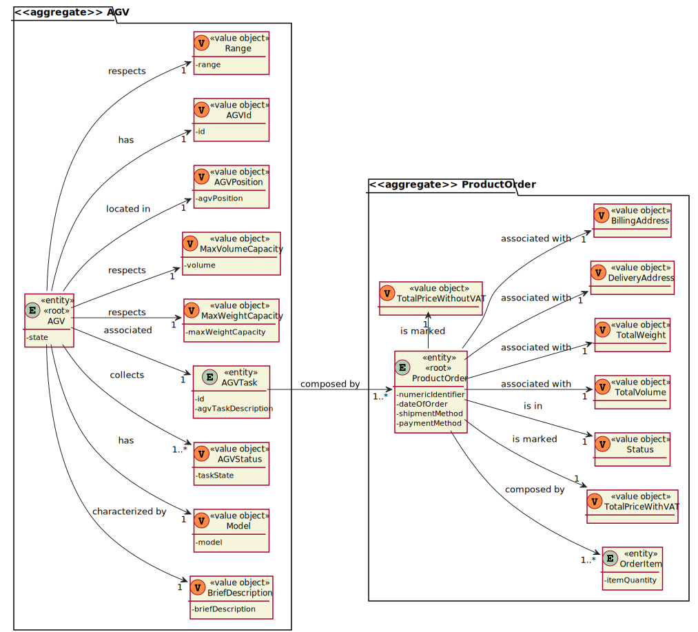

# 3. Design

- Para o desenvolvimento dessa US foram aplicados os padrões de 'design' DDD (Domain Drive Design).

## 3.1. Realização da Funcionalidade

### Diagrama de sequência do sistema
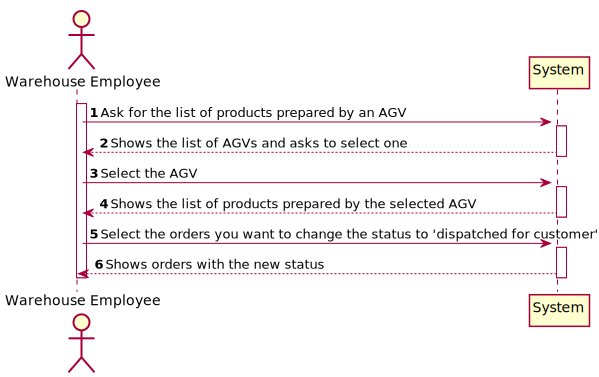

### Diagrama de sequência 
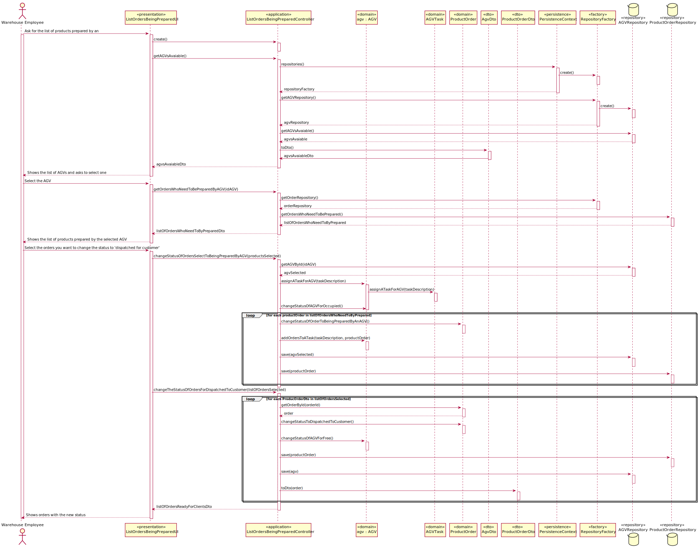

## 3.2. Diagrama de Classes

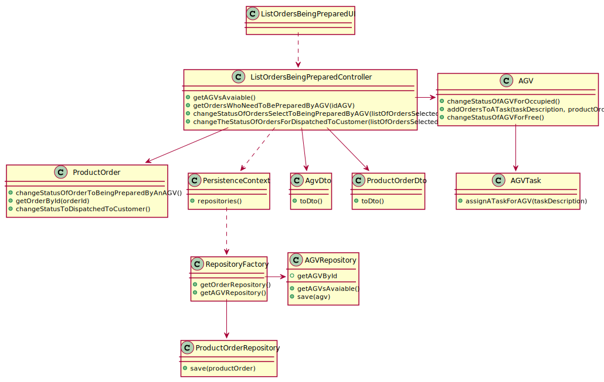

## 3.3. Padrões Aplicados

- Creator - ["A criação de objetos é uma das mais comuns atividades em um sistema orientado a objetos. Descobrir qual classe é responsável por criar objetos é uma propriedade fundamental da relação entre objetos de classes particulares."](https://pt.wikipedia.org/wiki/GRASP_(padr%C3%A3o_orientado_a_objetos)#Creator_(criador))

- Controller - ["A utilização do padrão Controller traz como benefício o isolamento das regras de negócios da lógica de apresentação, que é a interface com o usuário. Isto possibilita a existência de várias interfaces com o usuário que podem ser modificadas sem a necessidade de alterar as regras de negócios, proporcionando muito mais flexibilidade e oportunidades de reuso das classes."](https://www.devmedia.com.br/introducao-ao-padrao-mvc/29308#MVC)

- Repository - ["É uma forma de abstrair a persistência de dados. Ele deixa o mecanismo de como os dados são acessados isolados das regras de negócio. Não é a entidade e não é a conexão que faz a persistência, é o repositório, que é uma classe independente com as responsabilidades desacopladas."](https://pt.stackoverflow.com/questions/101692/como-funciona-o-padr%C3%A3o-repository)

- Factory - ["É um padrão de projeto de software (design pattern, em inglês) que permite às classes delegar para subclasses decidirem, isso é feito através da criação de objetos que chamam o método fabrica especificado numa interface e implementado por um classe filha ou implementado numa classe abstrata e opcionalmente sobrescrito por classes derivadas."](https://pt.wikipedia.org/wiki/Factory_Method)

- Persistence Context

## 3.4. Testes

**Teste 1 :** Verifica que se o volume total de uma encomenda extrapolar o limite suportado pelo AGV a encomenda não é atribuida a esse AGV.

    @Test
    void tryToAddOrdersUntilExtrapolatingTheAGVVolumeLimit() {

        AGV agv = buildAGV();

        agv.assignATaskForAGV(new AGVTask("Description"));

        Client client = buildClient();

        Product p = createProduct(5, 100);
        Product p1 = createProduct(50, 10000);
        Product p2 = createProduct(47, 10000);

        List<Product> products = new ArrayList<>();
        products.add(p);
        products.add(p1);
        products.add(p2);

        List<OrderItem> productOrders = transformProduct(products);

        ProductOrder productOrder = buildProductOrder(client, productOrders);

        boolean result = agv.addOrdersToATask("Description", productOrder);

        assertFalse(result);
    }

**Teste 2:** Verifica que se o volume total de uma encomenda for suportado pelo AGV a encomenda é atribuida a esse AGV.

    @Test
    void tryToAddOrdersUntilTheAGVVolumeLimit() {

        AGV agv = buildAGV();

        agv.assignATaskForAGV(new AGVTask("Description"));

        Client client = buildClient();

        Product p = createProduct(5, 200);
        Product p1 = createProduct(50, 200);
        Product p2 = createProduct(47, 200);

        List<Product> products = new ArrayList<>();
        products.add(p);
        products.add(p1);
        products.add(p2);

        List<OrderItem> productOrders = transformProduct(products);

        ProductOrder productOrder = buildProductOrder(client, productOrders);

        boolean result = agv.addOrdersToATask("Description", productOrder);

        assertTrue(result);
    }

**Teste 3:** Verifica que se o peso total de uma encomenda extrapolar o limite suportado pelo AGV a encomenda não é atribuida a esse AGV.
    
    @Test
    void tryToAddOrdersUntilExtrapolatingTheAGVWeightLimit() {

        AGV agv = buildAGV();

        agv.assignATaskForAGV(new AGVTask("Description"));

        Client client = buildClient();

        Product p = createProduct(200, 5);
        Product p1 = createProduct(100, 5);
        Product p2 = createProduct(150, 5);

        List<Product> products = new ArrayList<>();
        products.add(p);
        products.add(p1);
        products.add(p2);

        List<OrderItem> productOrders = transformProduct(products);

        ProductOrder productOrder = buildProductOrder(client, productOrders);

        boolean result = agv.addOrdersToATask("Description", productOrder);

        assertFalse(result);
    }

**Teste 4:** Verifica que se o peso total de uma encomenda for suportado pelo AGV a encomenda é atribuida a esse AGV.

    @Test
    void tryToAddOrdersUntilTheAGVWeightLimit() {

        AGV agv = buildAGV();

        agv.assignATaskForAGV(new AGVTask("Description"));

        Client client = buildClient();

        Product p = createProduct(100, 5);
        Product p1 = createProduct(100, 5);
        Product p2 = createProduct(100, 5);

        List<Product> products = new ArrayList<>();
        products.add(p);
        products.add(p1);
        products.add(p2);

        List<OrderItem> productOrders = transformProduct(products);

        ProductOrder productOrder = buildProductOrder(client, productOrders);

        boolean result = agv.addOrdersToATask("Description", productOrder);

        assertTrue(result);
    }

# 4. Implementação

- Conforme o ‘design’ feito e com o agregado em questão apara o desenvolvimento desse caso de uso, os sequintes excertos de código abaixo servem para confirmar a veracidade do 'design' proposto.

### Description
    
## AGVRepository

    package eapli.base.AGV.repositories;

    import eapli.base.AGV.domain.AGV;
    import eapli.base.AGV.domain.AGVId;
    import eapli.framework.domain.repositories.DomainRepository;
    
    public interface AGVRepository extends DomainRepository<AGVId, AGV> {

        public Iterable<AGV> getAGVsAvaiable();
        
        public AGV getAGVById(AGVId agvId);
    }

## JpaAGVRepository
    package eapli.base.persistence.impl.jpa;

    import eapli.base.AGV.domain.AGV;
    import eapli.base.AGV.domain.AGVId;
    import eapli.base.AGV.domain.AGVStatus;
    import eapli.base.AGV.repositories.AGVRepository;
    import eapli.framework.domain.repositories.TransactionalContext;
    import eapli.framework.infrastructure.repositories.impl.jpa.JpaAutoTxRepository;
    
    import javax.persistence.TypedQuery;
    
    public class JpaAGVRepository extends JpaAutoTxRepository<AGV, AGVId, AGVId> implements AGVRepository {
    
        public JpaAGVRepository(String persistenceName, String name) {
            super(persistenceName, name);
        }
    
        public JpaAGVRepository(TransactionalContext autoTx, String name){
            super(autoTx, name);
        }
    
        @Override
        public Iterable<AGV> getAGVsAvaiable() {
    
            final TypedQuery<AGV> query = entityManager().createQuery(
                    "SELECT d FROM AGV d  WHERE d.agvStatus = :status",
                    AGV.class);
            query.setParameter("status", new AGVStatus(AGVStatus.Status.FREE));
    
            return query.getResultList();
        }
    }

## ProductOrderDTO
    package eapli.base.ordermanagement.dto;

    import eapli.framework.representations.dto.DTO;
    
    import java.lang.annotation.Annotation;
    
    public class ProductOrderDto implements DTO {

        public long orderId;
    
        public String date;
    
        public String customerName;
    
        public String total;
    
        public String agvId;
    
        public String taskDescription;
    
        public String status;
    
        public ProductOrderDto(final long id, final String date, final String customerName, final String total){
            this.orderId = id;
            this.date = date;
            this.customerName = customerName;
            this.total = total;
        }
    
        public ProductOrderDto(String agvId, Long orderId, String taskDescription, String status) {
            this.orderId = orderId;
            this.agvId = agvId;
            this.taskDescription = taskDescription;
            this.status = status;
        }
    
    
        public ProductOrderDto(String agvId, Long orderId, String status) {
            this.orderId = orderId;
            this.agvId = agvId;
    
            this.status = status;
        }
    
        @Override
        public Class<? extends Annotation> annotationType() {
            return null;
        }
    }

# 5. Observações 

- Para a realização deste, caso de uso foi necessário promover o 'Value Object' 'AGVTask' para Entidade. Porém, ao tentar realizar essa alteração deparamo-nos com erros. Logo, para conseguirmos contornar a situação e avançarmos na implemtação dos casos de uso, provovemos o 'AGVTask' a 'Aggregate Root'. Porém, essa promoção, ocorre somente no código para evitar erros.

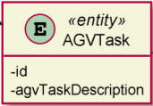
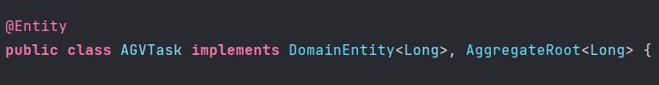

# 6. Integração/Demonstração
- As imagens abaixo servem para demonstrar o funcionamento do caso de uso.

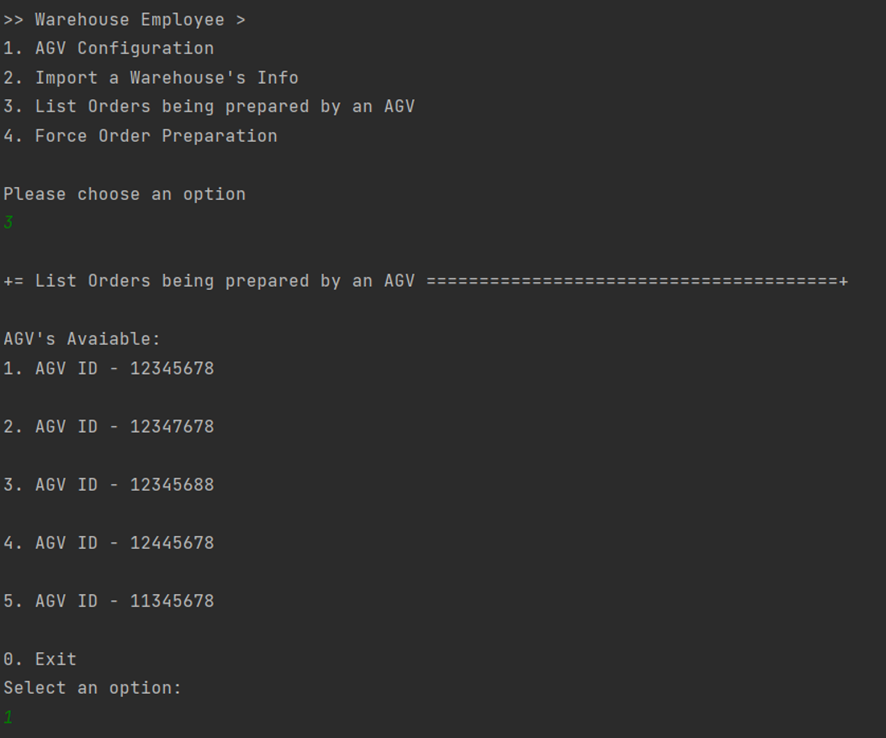
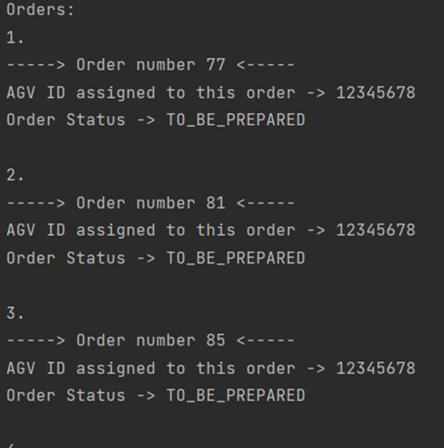
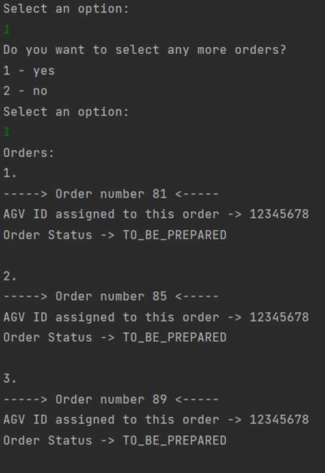
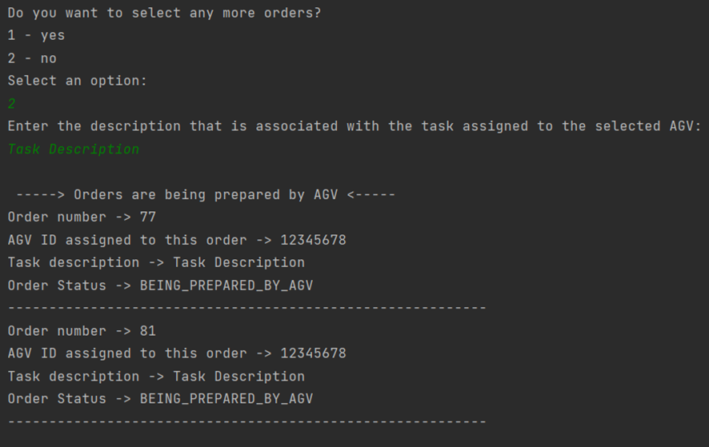
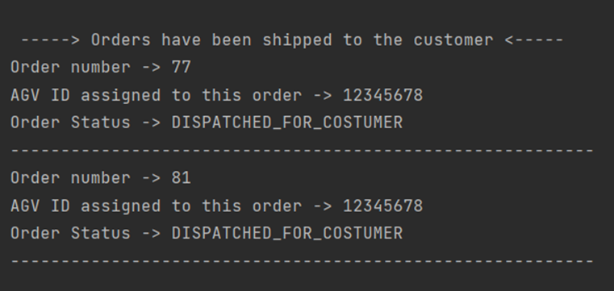