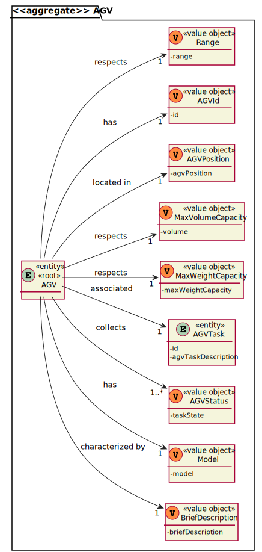
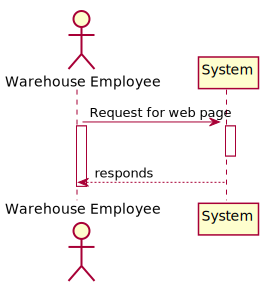
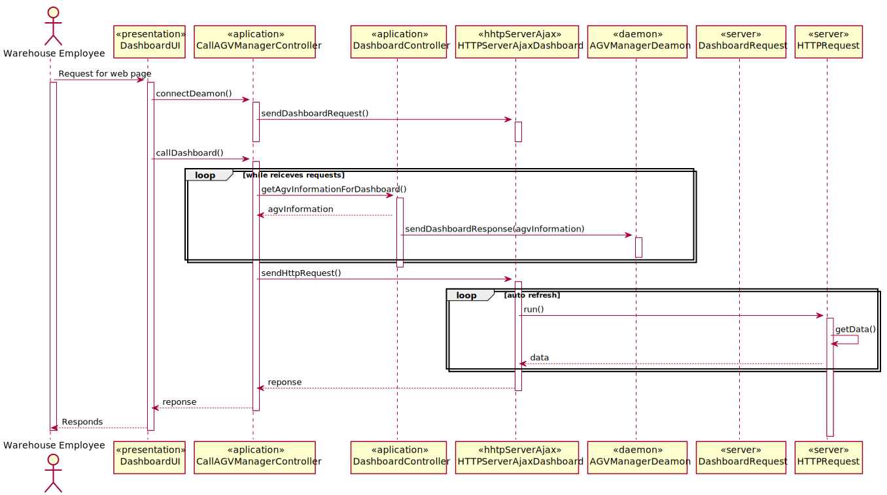

# US2005 - Como Funcionário do Armazém, quero abrir um painel web apresentando o status atual dos AGVs, bem como sua posição no layout do armazém e atualizado automaticamente (por exemplo: a cada minuto).
=======================================

# 1. Requisitos

**US2005** Como {Funcíonario do aramazém} pretendo...

- US2005.1- Quando o utilizador se autenticar, a aplicação da dashboard deve ficar a correr no 'background'.
- US2005.2- Quando a aplicação da dashboard atualizar a sua informação, deve ir buscar os dados ao AGVManager.

### 1.1 Especificações e esclarecimentos do cliente

> [Question:](https://moodle.isep.ipp.pt/mod/forum/discuss.php?d=16277)
> Dear Client,
> Question 1:It is mentioned that the warehouse is able to force a certain task to a certain AGV, but can this only happen when the AGV is free, or can the warehouse employee cancel a task and assign a new one.
> 
> Question 2:Despite in the provided sprint user stories asking for the digital twin in a web dashboard along with its status and position, in user stories of the next sprint it is said that the development of the movement of the AGV is needed which causes a minor confusion. My question is in this sprint is it required to create the movement of the AGV?
> 
> Question 3:How would you like the dashboard to look? A simple list of the AGVS along with its position and status?
> 
> Best Regards
> 
> [Awnser:](https://moodle.isep.ipp.pt/mod/forum/discuss.php?d=16277)
> Answers:
> Q1: In the scope of US 2003, the AGV is selected by the warehouse employee from the ones that are available and are able to perform the task. Tasks cannot be manually cancelled.
>
> Q2: On Sprint C, the web dashboard needs to be thought and ready to show the current AGVs position, which is read from some where. Further, on sprint D, when simulating the AGV movement the AGV position will change and, therefore, we will be able to see the AGVs position changing accordingly on the web dashboard.
>
> Notice that, this is an integrative project developed following an iterative and incremental process. So, at the end, the pieces need to fit well together.
>
> Q3: No! Preferably, the dashboard should be an approximation to what is depicted on Figure 8 of the specifications document.

> [Question:](https://moodle.isep.ipp.pt/mod/forum/discuss.php?d=16700)
>Dear client,
>Regarding this US it is said that "It must be used the provided application protocol (SPOMS2022). The dashboard is intended to be displayed on a web page provided by an existing HTTP server in the ""BackOfficeApp"" application (...)".
> 
>Our question is, between what applications should the SPOMS protocol be implemented? Should the HTTP server be part of the "BackOfficeApp" and communicate with the AGV Manager using the REQUESTS_API? Or should the HTTP server be its own application and communicate only with the "BackOfficeApp", which on the other hand communicates directly with the database?
> 
>Best Regards,
> 
>G03 2DC
>
> [Awnser:](https://moodle.isep.ipp.pt/mod/forum/discuss.php?d=16700)
>As it is being said the "HTTP Server" is part of the "Backoffice Application" in order to provide a local web page only. As so, the "HTTP Server" is a component of the "Backoffice Application".
>
>However, a question stands out: where the data to be presented by the "HTTP server" comes from?
>
>The "backoffice Application" (or one of its components) must, somehow, get the data from the "AGV Manager" (and/or the system database).
>
>In addition, you should notice that the SPOMS2002 protocol relies on the TCP and not on HTTP.
>
>There is nothing wrong here.
>
>If you still having doubts, I advice you to talk with technical support (in this case, preferably RCOMP lab teachers).

# 2. Análise

- Na dashboard deve constar, entre outros dados, o identificador dos AGVs, o estado dos AGVs e a sua posição atual.

- A dashboard deve ser um servidor http, acessível apenas por localhost, e deve apresentar
  os seus dados numa página html.

- A dashboard deve comunicar através do communication protocol com o AGVManager para conseguir
  a informação necessária.

## Exerto do modelo de domínio

# 3. Design

## 3.1. Realização da Funcionalidade

### Diagrama de sequência do sistema

### Diagrama de sequência 

### Diagrama de Classes

# 5. Integração/Demonstração

