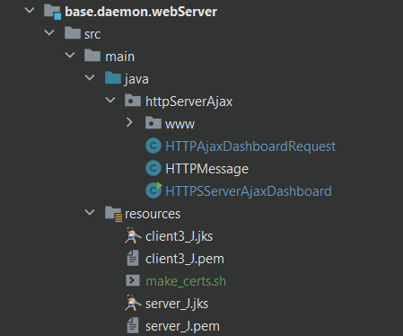
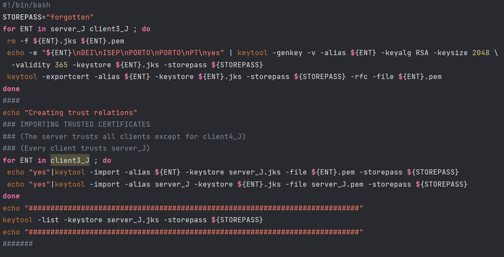

# US2006 - Como Gerente de Projeto, quero que as comunicações feitas através do protocolo SPOMS2022 sejam seguras/protegidas.
=======================================

# 1. Requisitos

**US2006** Como {Gerente de Projeto} pretendo...

- US2006.1- que as comunicações feitas através do protocolo SPOMS2022 sejam seguras/protegidas.

**Critérios de Aceitação**:

- Deve ser adotado SSL/TLS com autenticação mútua baseada em certificados de chave pública.
  Complementa a US2005.

# 2. Análise

- Para garantir que as comunicações realizadas entre o BackOffice Application
  e o HTTPs Server são seguras e protegidas foi utilizado o protocolo SSL/TLS, garantindo assim que
  a autenticação e a privacidade são impostas na camada de transporte.

# 3. Dados do Server e Certificados
- Os certificados utilizados para o servidor e para o cliente foram gerados através do 'script' make_certs.sh que se encontra na pasta "Projeto Java\base.daemon.webServer\src\main\resources\make_certs.sh".

- Código utilizado para gerar os certificados:

| Server IP   | Server Port | Trusted Store | Keys Store Pass |
|:------------|:------------|:--------------|:----------------|
| 127.0.0.1   | 443         | server_J.jks  | forgotten       |

## 3.1. Certificados Utilizados

- Para o servidor: server_J.jks 
- Para o cliente: cliente3_J.jks 

# 4. Implementação

## HTTPSServerAjaxDashboard

    public class HTTPSServerAjaxDashboard {
      private static final String TRUSTED_STORE = "server_J.jks";
      private static final String STORE_PATH = "base.daemon.webServer/src/main/resources/" + TRUSTED_STORE;
      private static final String KEYSTORE_PASS="forgotten";
      
      public static void main(String[] args) throws IOException {
      SSLSocket cliSock;
      
      System.setProperty("javax.net.ssl.trustStore", STORE_PATH);
      System.setProperty("javax.net.ssl.trustStorePassword", KEYSTORE_PASS);
      
      System.setProperty("javax.net.ssl.keyStore", STORE_PATH);
      System.setProperty("javax.net.ssl.keyStorePassword", KEYSTORE_PASS);
      
      try {
          SSLServerSocketFactory sslF = (SSLServerSocketFactory) SSLServerSocketFactory.getDefault();
          sock = (SSLServerSocket) sslF.createServerSocket(PORT);
      }
      catch(IOException ex) {
          System.out.println("Server failed to open local port " + PORT);
          System.exit(1);
      }
      
      while(true) {
          cliSock = (SSLSocket) sock.accept();
          HTTPAjaxDashboardRequest req = new HTTPAjaxDashboardRequest(cliSock, BASE_FOLDER);
          req.start();
          incAccessesCounter();
      }
      
      }
    }

## DashboardService

    public class DashboardService {
      private static final String TRUSTED_STORE = "client3_J.jks";
      private static final String STORE_PATH = "base.daemon.webServer/src/main/resources/" + TRUSTED_STORE;
      private static final String KEYSTORE_PASS="forgotten";
      
      public void openDashboard() throws IOException {
      
      System.setProperty("javax.net.ssl.trustStore", STORE_PATH);
      System.setProperty("javax.net.ssl.trustStorePassword", KEYSTORE_PASS);
      
      System.setProperty("javax.net.ssl.keyStore", STORE_PATH);
      System.setProperty("javax.net.ssl.keyStorePassword", KEYSTORE_PASS);
      
      SSLSocketFactory factory = (SSLSocketFactory) SSLSocketFactory.getDefault();
      
      try {
          serverIP = InetAddress.getByName("localhost");
      }
      catch(UnknownHostException ex) {
          System.out.println("Invalid SERVER-ADDRESS.");
          System.exit(1);
      }
      
      try { serverPort = 83; }
      catch(NumberFormatException ex) {
          System.out.println("Invalid SERVER-PORT.");
          System.exit(1);
      }
      
      try {
          sock =  (SSLSocket) factory.createSocket(serverIP,serverPort);
      }
      catch(IOException ex) {
          System.out.println("Failed to connect to provided SERVER-ADDRESS and SERVER-PORT.");
          System.out.println("Application aborted.");
          System.exit(1);
      }
      
      
      sOut = new DataOutputStream(sock.getOutputStream());
      
      sIn = new DataInputStream(sock.getInputStream());
      
      
      java.awt.Desktop.getDesktop().browse(URI.create("http://localhost:83"));
      }
    }

# 5. Integração/Demonstração

- Este caso de uso está relacionado ao caso de uso 2005 desenvolvido no Sprint C. A comunicação entre a camada de domínio, relacionada com as informações do Armazém e dos AGV's, necessárias para a página HTML serão feitas atráves de uma comunicação segura entre o Cliente e o servidor HTTPS.

