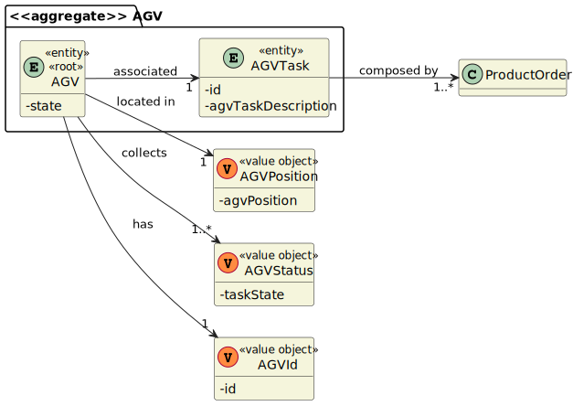
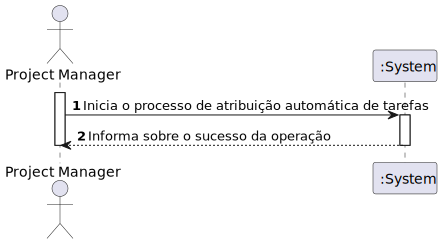
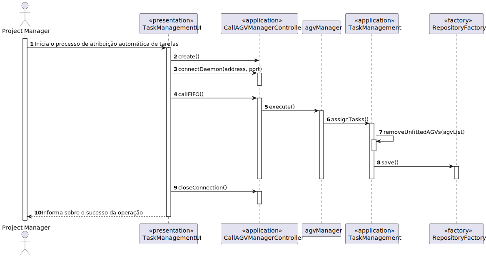
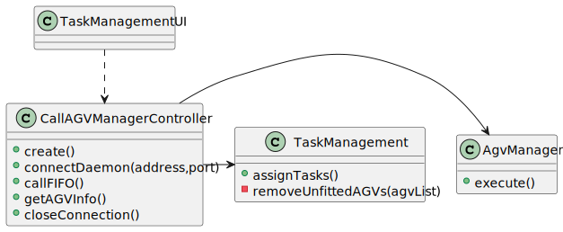

US4002 - As Project Manager, I want that the "AGVManager" component is enhanced with a basic FIFO algorithm to automatically assign tasks to AGVs.
=======================================

# 1. Requisitos

**As a Warehouse Employee, I want to set up the warehouse plant by uploading a JSON file.**

### 1.1 Especificações comunicadas pelo cliente

> [Questão](https://moodle.isep.ipp.pt/mod/forum/discuss.php?d=16394#p21103):
Dear client, In US4002 it is required that the AGV Manager should support automatic assignment of orders to AGVs. In US2003 the Warehouse Employee will be able to assign any order to an AGV available. If the orders are being automatically assigned to an AGV (US4002) how can the Warehouse Employee assign a specific order to an AGV?\
Best regards
>> **Resposta**: Great question!\
Usually, and by default, one intends that system automatically assigns orders to AGVs (US 4002).\
However, if such option is not available (e.g.: turned off) or by some reason an order needs to be prepared faster than it would normally be, the warehouse employee has the ability to assign tasks manually (US 2003).\
Notice that, orders that can be prepared by AGVs are being added to a queue following a FIFO algorithm (part of the US 4002). In the scope of US 2003 the FIFO algorithm does not apply... the employee might choose the order (s)he wants.

> [Questão](https://moodle.isep.ipp.pt/mod/forum/discuss.php?d=15781#p20356):
Dear Client,\
After analyzing the User Story 4002 -> "As Project Manager, I want that the "AGVManager" component is enhanced with a basic FIFO algorithm to automatically assign tasks to AGVs." the following doubts came to me:\
Will the FIFO algorithm be used to control the tasks/orders that are waiting for an available AGV? If I am interpreting something wrong please clarify for me.\
Talking about being automatic, the System executes this functionally after some other functionality, or executes it periodically? If it is periodically, how often?\
>> **Resposta**: There are some answers/explanations:\
Q1: The general idea is that product orders reaching a certain state whose meaning is of "need to be prepared by an AGV" are added to a queue. Then, following the FIFO algorithm orders are removed from the queue and assigned to available AGVs capable of performing the task that such order implies.\
Q2: Teams are free to propose a solution for that problem/issue. Notice that all team decisions must be well supported in light of business need and technical constraints.

# 2. Análise

### Domain Model Excerpt

### System Sequence Diagram

# 3. Design

- Nesta secção é descrito e demonstrado o design adotado para satisfazer a funcionalidade requisitada.

## 3.1. Realização da Funcionalidade

### Sequence Diagram

## 3.2. Diagrama de Classes

### Class Diagram

## 3.3. Padrões Aplicados

- Controller
- Creator
- Repository
- Factory

- (Juntamente com os princípios de desenvolvimento SOLID)

# 4. Implementação

- Esta User Story levou à alteração da AGVTask para Entity invés de Value Object

- Foi também necessária a implementação de um atributo na class AGVTask que indica que o estado da mesma (por atribuir, em progresos, concluída).

# 5. Integração/Demonstração

# 6. Observações

A elevada dependência da mesma com a base de dados e o Servidor TCP dificultaram o processo de testagem da mesma.
