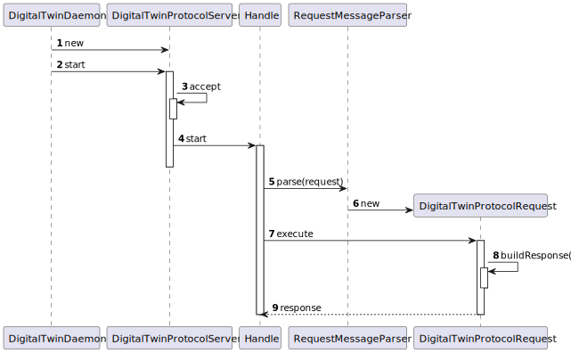
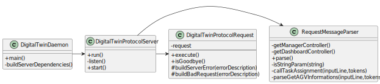

US5001 - As Project Manager, I want that the team start developing the input communication module of the AGV digital twin to accept requests from the "AGVManager"
=======================================

# 1. Requisitos

**As Project Manager, I want that the team start developing the input communication module of the AGV digital twin to accept requests from the "AGVManager"**

## Especificações comunicadas pelo cliente

> [Question](https://moodle.isep.ipp.pt/mod/forum/discuss.php?d=16593#p21287):
> What type of communication do you want, i.e., what are the communications that you want to have between these two. Like AGV Manager says "Take a product" and AGV Digital Twin says "Taken"? Is it something like that? Or am i confused?\
>
> Answer: The communication must follow the SPOMS2022 protocol. It is up to you and your team to devise a set of messages fulfilling the business requirements properly.

-

> [Question]() Regarding the USs 1901,4001, 5001, and 5002, what would you consider its complete state, that is, what would be the criterion to define whether or not this US is functional?
>
> Answer: For all of those US, the communication between the two involved components must be implemented in accordance with the SPOMS2022. The requests processing can be somehow mocked. For instance, if processing a request implies saving some data to the database, the component can instead write such data to a log (mocking).
>
>Later, on next sprint, the teams implement the interaction to the database.
However, it is not advisable mocking everything, namely the components (internal) state. Notice that by mocking you are letting extra effort to the next sprint.\
Finally, all US must be demonstrable.

# 3. Design

### Sequence Diagram

### Class Diagram

