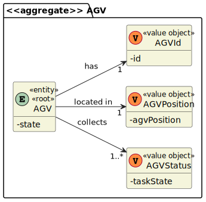
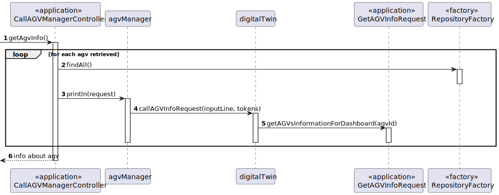
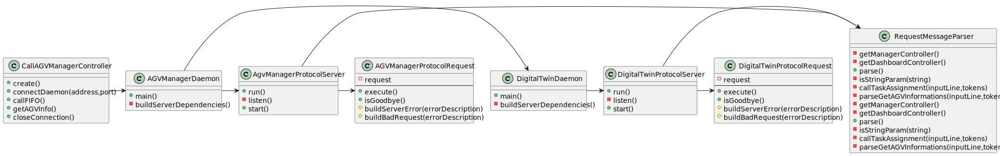

US2001 -  As Project Manager, I want that the team start developing the output communication module of the AGV digital twin to update its status on the "AGVManager".
=======================================

# 1. Requisitos

**As Project Manager, I want that the team start developing the output communication module of the AGV digital twin to update its status on the "AGVManager"**

### 1.1 Especificações comunicadas pelo cliente

# 2. Análise

### Domain Model Excerpt

# 3. Design

- Nesta secção é descrito e demonstrado o design adotado para satisfazer a funcionalidade requisitada.

## 3.1. Realização da Funcionalidade

### Sequence Diagram

## 3.2. Diagrama de Classes

### Class Diagram

## 3.3. Padrões Aplicados

- Controller
- Creator
- Repository
- Factory

- (Juntamente com os princípios de desenvolvimento SOLID)

# 6. Observações

A Conexão da mesma com o AGVManager com o DigitalTwin tornou-se conflituosa, embora solucionável.