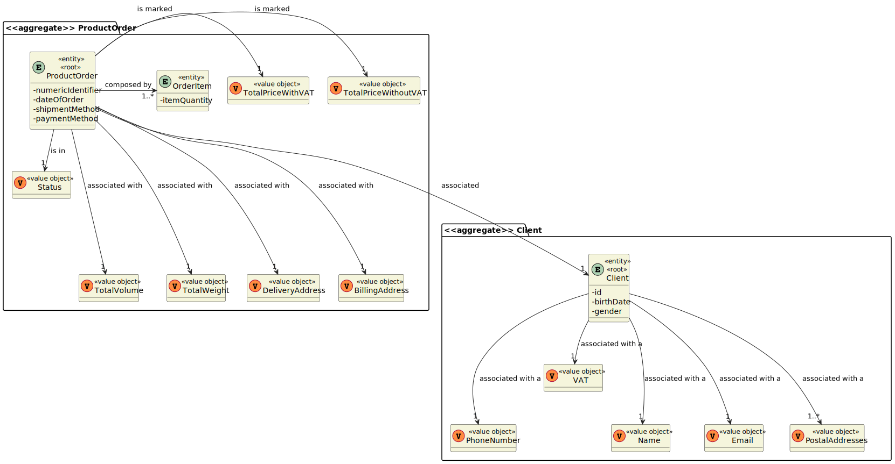
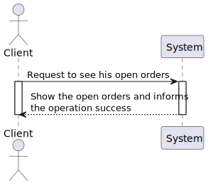
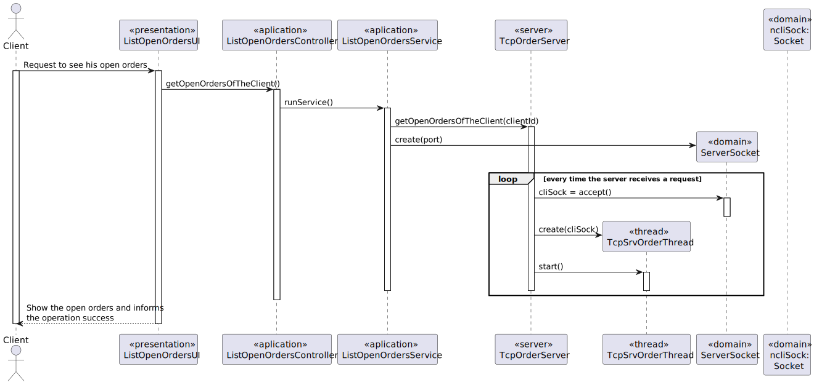
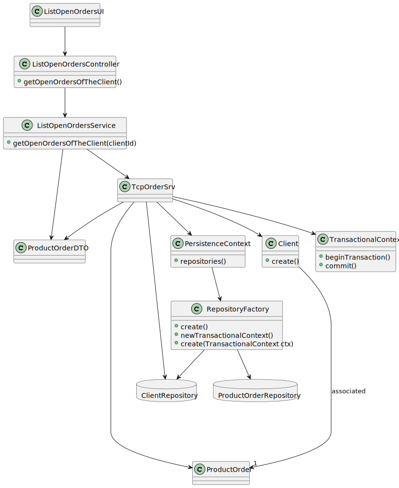
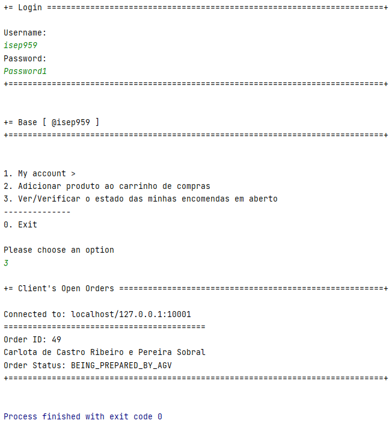
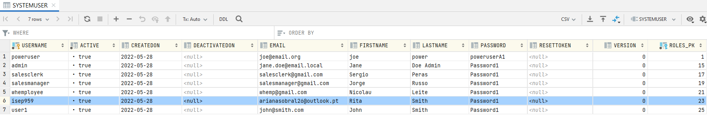
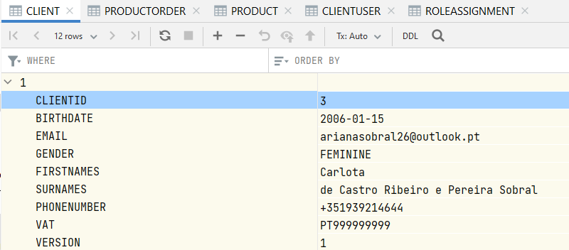
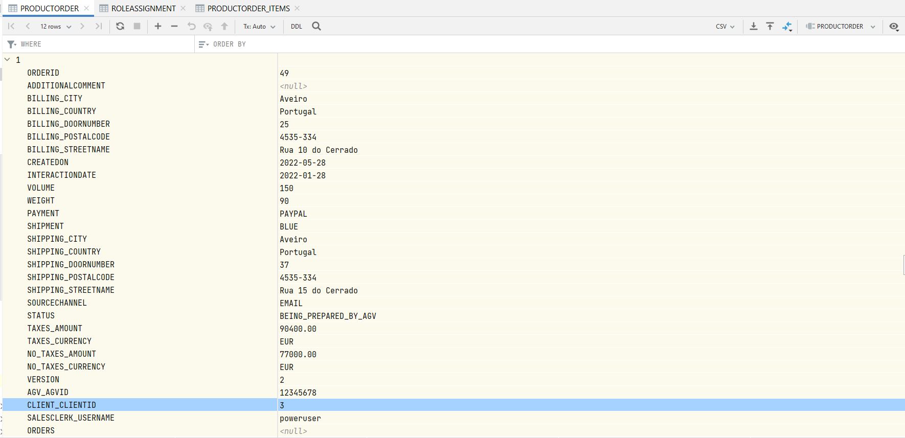

US1502 - Como Cliente, quero ver/verificar o estado das minhas encomendas em aberto.
=======================================

# 1. Requisitos

**US1502** Como {Cliente} pretendo...

- US1502.1- Acessar a lista de pedidos que já realizei.

A interpretação feita deste requisito foi a seguinte:

Como sou um Cliente, ou seja, um ator do sistema, precisso acessar ao sistema para visualizar que pedidos já realizei.

### 1.1 Especificações e esclarecimentos do cliente

> [Question:]()
> 
> [Awnser:]()

# 2. Análise

- Após a análise da US, concluiu-se que este caso de uso depende da US1901 visto que é obrigatório a utilização da componente 'OrderServer'.

# 2.1.  Fluxo de Troca de Mensagens

1. **Espera** pela mensagem do **Cliente** com o **Código COMMTEST (0)**.
2. **Manda** ao **Cliente** o **Código ACK (2)**.
3. **Espera** pela mensagem do **Cliente** com a informação que precisa obter.
4. **Envia** as informações pedidas ao **Cliente**.
5. **Espera** pela mensagem do **Cliente** com o **Código de Fim (1)**.
6. **Manda** ao **Cliente** o **Código de Entendido (2)**.
7. **Fecha** o Socket.

* (**NOTA**: Caso exista algum problema durante a troca de mensagens o **socket é fechado**)

| Código | Request                                   |
|--------|-------------------------------------------|
| 6      | Obter as encomendas associadas ao cliente |

## Exerto do modelo de domínio

# 3. Design

- Para o desenvolvimento dessa US foram aplicados os padrões de 'design' DDD (Domain Drive Design).

## 3.1. Realização da Funcionalidade

### Diagrama de sequência do sistema

### Diagrama de sequência

## 3.2. Diagrama de Classes

## 3.3. Padrões Aplicados

- Creator - ["A criação de objetos é uma das mais comuns atividades em um sistema orientado a objetos. Descobrir qual classe é responsável por criar objetos é uma propriedade fundamental da relação entre objetos de classes particulares."](https://pt.wikipedia.org/wiki/GRASP_(padr%C3%A3o_orientado_a_objetos)#Creator_(criador))

- Controller - ["A utilização do padrão Controller traz como benefício o isolamento das regras de negócios da lógica de apresentação, que é a interface com o usuário. Isto possibilita a existência de várias interfaces com o usuário que podem ser modificadas sem a necessidade de alterar as regras de negócios, proporcionando muito mais flexibilidade e oportunidades de reuso das classes."](https://www.devmedia.com.br/introducao-ao-padrao-mvc/29308#MVC)

- Repository - ["É uma forma de abstrair a persistência de dados. Ele deixa o mecanismo de como os dados são acessados isolados das regras de negócio. Não é a entidade e não é a conexão que faz a persistência, é o repositório, que é uma classe independente com as responsabilidades desacopladas."](https://pt.stackoverflow.com/questions/101692/como-funciona-o-padr%C3%A3o-repository)

- Factory - ["É um padrão de projeto de software (design pattern, em inglês) que permite às classes delegar para subclasses decidirem, isso é feito através da criação de objetos que chamam o método fabrica especificado numa interface e implementado por um classe filha ou implementado numa classe abstrata e opcionalmente sobrescrito por classes derivadas."](https://pt.wikipedia.org/wiki/Factory_Method)

- Persistence Context

## 3.4. Testes

# 4. Implementação

### Classe ListOpenOrdersUI

    package eapli.base.app.user.console.presentation.productOrder;

    import eapli.base.clientusermanagement.domain.ClientUser;
    import eapli.base.ordermanagement.application.ListOpenOrdersController;
    import eapli.base.ordermanagement.dto.ProductOrderDto;
    import eapli.framework.infrastructure.authz.application.AuthzRegistry;
    import eapli.framework.infrastructure.authz.domain.model.SystemUser;
    import eapli.framework.presentation.console.AbstractUI;
    import org.springframework.boot.autoconfigure.security.SecurityProperties;
    
    import java.util.List;
    
    public class ListOpenOrdersUI extends AbstractUI {

        private final ListOpenOrdersController controller = new ListOpenOrdersController();
        private boolean endOp = false;
    
    
        @Override
        protected boolean doShow() {
            
    
           do{
               // get orders
               List<ProductOrderDto> list = controller.getOpenOrdersOfAClient(controller.getClientLogged());
    
               if(list.size()==0){
                   System.out.println("Orders list is empty.");
                   endOp = true;
               }
    
               for(ProductOrderDto po: list){
                   System.out.println("==========================================");
                   System.out.println("Order ID: " + po.orderId);
                   System.out.println(po.clientName);
                   System.out.println("Order Status: " + po.status);
               }
               endOp=true;
           } while(!endOp);
    
           return true;
    
        }
    
        @Override
        public String headline() {
            return "Client's Open Orders";
        }

    }

### Classe ListOpenOrdersController

    package eapli.base.ordermanagement.application;

    import eapli.base.ordermanagement.domain.ProductOrder;
    import eapli.base.ordermanagement.dto.ProductOrderDto;
    import eapli.framework.infrastructure.authz.application.AuthorizationService;
    import eapli.framework.infrastructure.authz.application.AuthzRegistry;

    import java.util.ArrayList;
    import java.util.List;

    public class ListOpenOrdersController {

        private final AuthorizationService authz = AuthzRegistry.authorizationService();
    
        private final ListOpenOrdersService service = new ListOpenOrdersService();
    
    
        public List<ProductOrderDto> getOpenOrdersOfAClient(Long clientId){
    
            List<ProductOrderDto> list = new ArrayList<>();
            Iterable<ProductOrder> po = service.getOpenOrdersOfTheClient(clientId);
    
            for (ProductOrder productOrder : po) {
                Long id = productOrder.getOrderId();
                String client = productOrder.obtainClient().obtainName().toString();
                String status = productOrder.getOrderStatus().toString();
                ProductOrderDto productOrderDto = new ProductOrderDto(id, client,status);
                list.add(productOrderDto);
            }
            return list;
        }
    
        public Long getClientLogged(){
    
            String email = authz.session().get().authenticatedUser().email().toString();
    
            return service.getClientId(email);
        }

    }
`
### Classe ListOpenOrdersService

    package eapli.base.ordermanagement.application;
    
    import eapli.base.MessageUtils;
    import eapli.base.clientmanagement.domain.Email;
    import eapli.base.clientmanagement.repositories.ClientRepository;
    import eapli.base.clientusermanagement.repositories.ClientUserRepository;
    import eapli.base.infrastructure.persistence.PersistenceContext;
    import eapli.base.ordermanagement.domain.ProductOrder;
    
    import java.io.DataInputStream;
    import java.io.DataOutputStream;
    import java.io.IOException;
    import java.io.ObjectInputStream;
    import java.net.InetAddress;
    import java.net.Socket;
    import java.net.UnknownHostException;
    
    
    
    public class ListOpenOrdersService {
    
        private final ClientRepository clientRepository = PersistenceContext.repositories().client();
    
        private static class ClientSocket {
            private Socket sock;
            private InetAddress serverIP;
            private DataOutputStream sOutData;
            private DataInputStream sInData;
    
            public void connect(final String address, final int port) throws IOException {
    
                try {
                    serverIP = InetAddress.getByName(address);
                } catch (UnknownHostException ex) {
                    System.out.println("Invalid server specified: " + serverIP);
                    System.exit(1);
                }
    
                try {
                    sock = new Socket(serverIP, port);
                } catch (IOException ex) {
                    System.out.println("Failed to establish TCP connection");
                    System.exit(1);
                }
    
                System.out.println("Connected to: " + serverIP + ":" + 10001);
    
                sOutData = new DataOutputStream(sock.getOutputStream());
                sInData = new DataInputStream(sock.getInputStream());
            }
    
            public void stop() throws IOException {
                sock.close();
            }
        }
        public Iterable<ProductOrder> getOpenOrdersOfTheClient(Long clientId) {
            Iterable<ProductOrder> productsOrders = null;
            try {
    
                final var socket = new ClientSocket();
                socket.connect(getAddress(), getPort());
                try {
                    if (MessageUtils.testCommunicationWithServer(socket.sOutData, socket.sInData)) {
    
                        MessageUtils.writeMessageWithData((byte) 6, clientId.toString(), socket.sOutData);
    
                        // mostrar os produtos existentes
                        ObjectInputStream sInputObject = new ObjectInputStream(socket.sock.getInputStream());
                        productsOrders = (Iterable<ProductOrder>) sInputObject.readObject();
    
                        if (MessageUtils.wantsToExit(socket.sOutData, socket.sInData)) {
                            socket.stop();
    
                        } else {
                            System.out.println("==> ERROR: Erro no pacote do Servidor");
    
                        }
                    } else {
                        System.out.println("==> ERROR: Erro no pacote do Servidor");
                    }
                } catch (IOException e) {
                    System.out.println("==> ERROR: Falha durante a troca de informação com o server");
                } finally {
                    try {
                        socket.stop();
                    } catch (IOException e) {
                        System.out.println("==> ERROR: Falha a fechar o socket");
                    }
                }
    
                return productsOrders;
            } catch (Exception e) {
                System.out.println("Server down");
                System.out.println(e.getMessage());
                return productsOrders;
            }
    
        }
    
        public Long getClientId(String email){
    
            return clientRepository.findByEmail(new Email(email)).get().identity();
    
        }
        private int getPort() {
            return 10001;
        }
    
        private String getAddress() {
            return "localhost";
        }
    }

### TcpOrderSrv
    ...
    if (clientMessageUS[1] == ConstantsServer.OPEN_ORDERS){

        Long clientId = Long.parseLong(MessageUtils.getDataFromMessage(clientMessageUS,sIn));
        Iterable<ProductOrder> productOrderList = orderRepository.getOpenOrdersOfAClient(clientId);
        ObjectOutputStream sOutputObject = new ObjectOutputStream(this.s.getOutputStream());

        sOutputObject.writeObject(productOrderList);
        sOutputObject.flush();
    }
    ...

# 5. Observações

* Como para esta US é requisito a utilização do TcpOrderSrv, acrescentou-se ao mesmo os métodos necessários que compreendem este caso de uso.

# 6. Integração/Demonstração

* Com a finalidade de demonstrar o bom funcionamento da US, iniciou-se sessão com a conta do User de id 3.

#### Consola

### Tabelas

##### Tabela do System User

##### Tabela do Client

##### Tabela da Product Order

