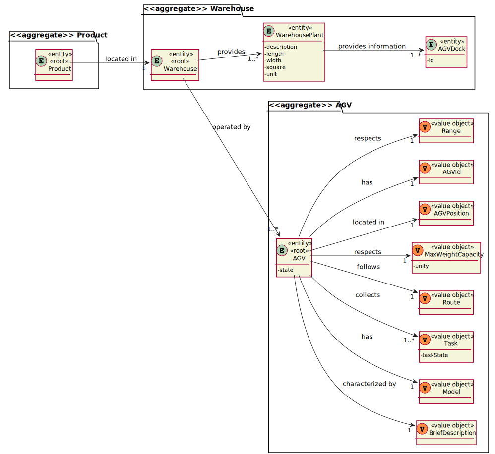
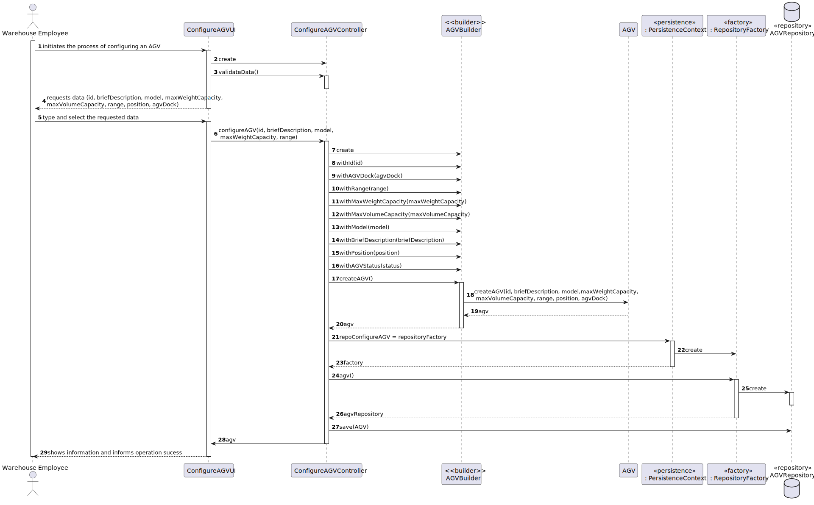
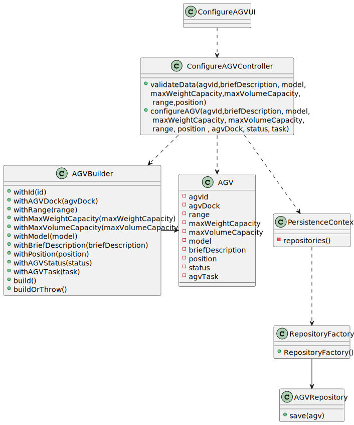
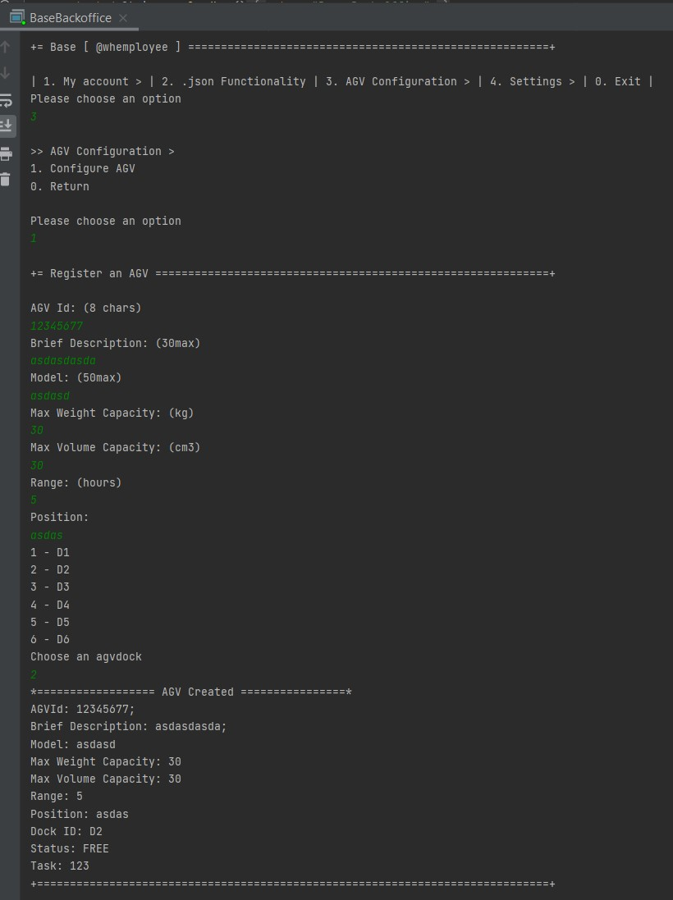

US2002
=======================================

# 1. Requirements

### As a Warehouse Employee, I want to configure the AGV's available in the Warehouse.

## Customer Specifications
>Question: There is a need to each AVG has its own avg dock? If it does makes sence to give him a responsible avg?
> 
>[Awnser:](https://moodle.isep.ipp.pt/mod/forum/discuss.php?d=15824#p20334) Every AGV has a base location, i.e.  an AGV dock. The same AGV dock can not be used by two (or more) distinct AGVs.

>Question: A single AGV dock, no matter how large, can only be the base for one AGV robot.
>
>[Awnser:](https://moodle.isep.ipp.pt/mod/forum/discuss.php?d=15688#p20163) Yes. That is correct.

>Question: What do you understand about configuring the AGV's available on the warehouse. What changes the warehouse employee can do in his specifics and actions/taks?
>
>[Awnser:](https://moodle.isep.ipp.pt/mod/forum/discuss.php?d=15672#p20145) Within this context, "configuring the AGVs available on the warehouse" means that the Warehouse Employee needs to specify which are the AGV operating in the warehouse and, therefore, define some basic information regarding each AGV.
> Please, read carefully the specifications' document to find ou which information is need. An highlight is provided below.
> "The AGVs operating on the warehouse, its characteristics (e.g.: identifier, short description, model, and maximum weight it can carry) and its base location (i.e., the AGV dock). In addition, it is necessary to know the AGV status regarding its autonomy (e.g.: 2 hours left) and current task (e.g.: free, charging, occupied serving a given order)." (cf. Specifications' document)

>Question: Can we conclude that if the AGV does not support the weight required for an Order, it automatically rejects this task?
>
>[Awnser:](https://moodle.isep.ipp.pt/mod/forum/discuss.php?d=15579#p20035) Yes! But, notice that regarding AGV Digital Twin the "automatically" is implemented by your team.

>Question: Should the id be generated automatically?
>
>[Awnser:](https://moodle.isep.ipp.pt/mod/forum/discuss.php?d=15988#p20541) No!

>Question: When we want to configure an agv, should we ask for a list of available agv where we will choose one or will it (automatically) be given one that is available?
>
>[Awnser:](https://moodle.isep.ipp.pt/mod/forum/discuss.php?d=15988#p20541) There is no list of AGV to choose from. The user specifies the AGV that exist in the warehouse. So, the user is creating the list of AGVs.

>Question: How many agvs can the base location of wharehouse have?
>
>[Awnser:](https://moodle.isep.ipp.pt/mod/forum/discuss.php?d=15988#p20541) As said before, 1 AGV per dock.

>Question: When we want to set the agv, does this mean we will create one or will we redefine one that exists and is available (without any task)?
>
>[Awnser:](https://moodle.isep.ipp.pt/mod/forum/discuss.php?d=15988#p20541) I do not understand this question in the scope of US 2002.

>Question: Should the weight, volume, model and capacity of the agv be constant?
>
>[Awnser:](https://moodle.isep.ipp.pt/mod/forum/discuss.php?d=15988#p20541) Such information varies from one AGV to another. Otherwise, it would not make any sense.

>Question: Imagining that we have 5 docs we will have 5 agvs imagining that the 5 are already busy with another task (status: charging, doing a task) is it possible to configure it even being busy (status different from free) or is it only possible to configure the agv when it is with status: free ?
>
>[Awnser:](https://moodle.isep.ipp.pt/mod/forum/discuss.php?d=15988#p20541)  Through US 2002, the system knows which AGVs are operating in the warehouse and the characteristics of each one, including the dock that each AGV has as its base location. Notice that, for instance, despite of existing 5 docks in the warehouse, the number of AGVs operating in the warehouse might be lesser than 5.

>Question: What should the default autonomy when creating an AGV be?
>
>[Awnser:](https://moodle.isep.ipp.pt/mod/forum/discuss.php?d=15961#p20491) There is no default value. The user must type the AGV autonomy in minutes according to the manufacture specifications.

>Question: Should  a list of warehouses be shown for the AGV to be assigned or should the AGV be automatically assigned to the warehouse where the warehouse employee works?
>
>[Awnser:](https://moodle.isep.ipp.pt/mod/forum/discuss.php?d=15961#p20491) As I said before, for now, there is only one warehouse.

>Question: Could you specify the business rules associated with the identifier, short description, and model of the AGVS.
>
>[Awnser:](https://moodle.isep.ipp.pt/mod/forum/discuss.php?d=15961#p20491) You should apply general validation rules such as:
>> identifier: not empty alphanumeric code with at 8 chars maximum;
>
>> short description: not empty having 30 chars maximum;
>
>> model: not empty having 50 chars maximum;
>
> For other necessary attributes, you should follow common-sense.

>Question: Are the current tasks provided(free, charging, occupied serving a given order) fixed, or more could be added?
>
>[Awnser:](https://moodle.isep.ipp.pt/mod/forum/discuss.php?d=15961#p20491) I would not called it task but, instead, AGV status.
> Besides those status I can foresee another status: in maintenance. If you find out more AGV status useful, you might adopt them and further explain/argue about their pertinence.

>Question: Should it be possible to still create an AGV without assigning it to an AGV Dock (in case of none being available)?
>
>[Awnser:](https://moodle.isep.ipp.pt/mod/forum/discuss.php?d=15961#p20491) No! The AGV Dock is mandatory.

>Question: Should it be possible to edit an AGV configuration, or is that outside the scope of US2002?
>
>[Awnser:](https://moodle.isep.ipp.pt/mod/forum/discuss.php?d=15961#p20491)  It outside of scope. But, if you want, you can do it.

## Teacher Clarification
>Clarification: Esclarecimentos adicionais sobre alguns casos de uso
>
>[Awnser:](https://moodle.isep.ipp.pt/mod/forum/discuss.php?d=16072#p20647) A informação contida no ficheiro JSON deve ser utilizada para validar se a docking do AGV existe no caso de uso 2002

# 2. Analysis

### Main success scenario
1. Warehouse Employee requires the configuration of an AGV available in the Warehouse.
2. The System asks for information related to the AGV
3. Warehouse Employee enters the information.
8. The System reports the success of the operation.

### Conditions
The registration information of the new category is persisted/saved in the system.

## 2.1. System Sequence Diagram

## 2.2. Partial Domain Model

# 3. Design

## 3.1. Realização da Funcionalidade

## 3.2. Diagrama de Classes

## 3.3. Padrões Aplicados

Foram aplicados os princípios SOLID e os padrões de design de software GoF. Sendo o que exigiu maior pensamento e reflexão sobre se faria sentido aplicar foi o Builder.

## 3.4. Testes 

**Teste 1:** Get Range Method verification.

	 @Test
    void getRange() {
        AGVId id = new AGVId("12345678");
        BriefDescription description = new BriefDescription("abcdefg");
        MaxWeightCapacity weight = new MaxWeightCapacity(200.0);
        MaxVolumeCapacity volume = new MaxVolumeCapacity(200);
        Model model = new Model("2.1.1.1");
        ChangeAGVStatus status = new ChangeAGVStatus("FREE");
        Range a = new Range(5.0);
        AGVTask task = new AGVTask("x");
        AGVPosition pos = new AGVPosition("s");
        AGVDock dock = new AGVDock();

        AGV a1 = new AGV(id,description,model,weight,volume,a,pos,dock,status,task);
        AGV a2 = new AGV(id,description,model,weight,volume,a,pos,dock,status,task);
        Assertions.assertEquals(a1.getRange(), a2.getRange());
    }

# 4. Implementação

### AGVBuilder() implementation

    package eapli.base.AGVManagement.Domain;

    import eapli.base.warehouse.domain.AGVDock;
    import eapli.framework.domain.model.DomainFactory;

    public class AGVBuilder implements DomainFactory<AGV> {

    private AGV agv;

    private AGVId id;

    private AGVDock agvDock;

    private Range range;

    private MaxWeightCapacity maxWeightCapacity;

    private MaxVolumeCapacity maxVolumeCapacity;

    private Model model;

    private BriefDescription briefDescription;

    private AGVPosition position;

    private ChangeAGVStatus status;

    private AGVTask task;

    public AGVBuilder withId(final AGVId id) {
        this.id = id;
        return this;
    }

    public AGVBuilder withAGVDock(final AGVDock agvDock){
        this.agvDock = agvDock;
        return this;
    }

    public AGVBuilder withRange(final Range range) {
        this.range = range;
        return this;
    }

    public AGVBuilder withMaxWeightCapacity(final MaxWeightCapacity maxWeightCapacity) {
        this.maxWeightCapacity = maxWeightCapacity;
        return this;
    }

    public AGVBuilder withMaxVolumeCapacity(final MaxVolumeCapacity maxVolumeCapacity) {
        this.maxVolumeCapacity = maxVolumeCapacity;
        return this;
    }

    public AGVBuilder withModel(final Model model) {
        this.model = model;
        return this;
    }

    public AGVBuilder withBriefDescription(final BriefDescription briefDescription) {
        this.briefDescription = briefDescription;
        return this;
    }

    public AGVBuilder withPosition(final AGVPosition position){
        this.position = position;
        return this;
    }

    public AGVBuilder withAGVStatus(final String status){
        this.status = new ChangeAGVStatus(status);
        return this;
    }
    public AGVBuilder withAGVTask(final String task){
       this.task = new AGVTask(task);
       return this;
    }

    @Override
    public AGV build() {
        final AGV ret = buildOrThrow();
        agv = null;
        return  ret;
    }

    private AGV buildOrThrow() {
        if (agv != null) {
            return agv;
        } else if (id != null && range != null && maxWeightCapacity != null && maxVolumeCapacity != null && model != null && briefDescription != null && agvDock != null && status != null && task != null) {
            agv = new AGV(id,briefDescription, model, maxWeightCapacity, maxVolumeCapacity, range, position, agvDock, status, task);
            return agv;
        } else {
            throw new IllegalStateException();
        }
    }
    }

# 5. Integração/Demonstração

*Nesta secção a equipa deve descrever os esforços realizados no sentido de integrar a funcionalidade desenvolvida com as restantes funcionalidades do sistema.*

# 6. Observações

