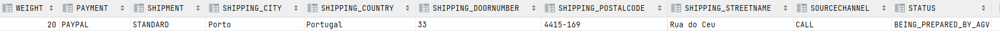

US2003
=======================================

# 1. Requirements

###  As Warehouse Employee, I want to access the list of orders that need to be prepared by an AGV and be able to ask/force any of those orders to be immediately prepared by an AGV available.

## Document Specifications
> Assign a task/order to an AGV. Any order that has been paid represents a task that can be assigned to an AGV. 
The task consists of picking up all the items of the respective order. The assignment of a task to an AGV can be done: 
>> a.  Automatically by the system. Currently, a basic FIFO (first in, first out) algorithm is foreseen as acceptable. However, latter on a more complex algorithm might be needed.
>
>> b. Manually by a warehouse employee. In this case, the employee identifies both the intended order and the intended AGV.
>
>> c. Either done automatically or manually the AGV constraints regarding volume and weight must be verified.

## Customer Specifications
> Question: What would be the minimum information needed to show the User in order to select the desired Order? From our meeting the minimum result was the Identification , total Weigth and Total Volume. Should we add something else?
> 
> [Awnser:](https://moodle.isep.ipp.pt/mod/forum/discuss.php?d=16480#p21147) I would say that from the warehouse employee point of view, it is useful to show the order id, the order date, the customer id/name and order total.
> The total weight and total volume might be also useful if (s)he knows the AGV' characteristics. However, it is up to the system ensure that the selected AGV is capable of fulfilling the task.

> Question: In US2003 the Warehouse Employee will be able to assign any order to an AGV available. If the orders are being automatically assigned to an AGV (US4002) how can the Warehouse Employee assign a specific order to an AGV?
>
> [Awnser:](https://moodle.isep.ipp.pt/mod/forum/discuss.php?d=16394#p21052) Usually, and by default, one intends that system automatically assigns orders to AGVs (US 4002).
However, if such option is not available (e.g.: turned off) or by some reason an order needs to be prepared faster than it would normally be, the warehouse employee has the ability to assign tasks manually (US 2003).
Notice that, orders that can be prepared by AGVs are being added to a queue following a FIFO algorithm (part of the US 4002). In the scope of US 2003 the FIFO algorithm does not apply... the employee might choose the order (s)he wants.

> Question: Knowing that in US2003 it is only mentioned that the Warehouse Employee will do this action, I would like to know if it is part of the System to allow users with greater skills and responsibilities (Warehouse Managers or Admins) to also perform the same task? If yes, which users?
>
> [Awnser:](https://moodle.isep.ipp.pt/mod/forum/discuss.php?d=16291#p20908) No! There is not such need.

> Question: Regarding this feature, what would you consider to be its complete state, that is, what would be the criterion to define whether or not this feature was functional?
>
> [Awnser:](https://moodle.isep.ipp.pt/mod/forum/discuss.php?d=16290#p20907) The warehouse employee is able to (i) select an order that needs to be prepared; (ii): select the AGV from the ones that are available and able to perform the task; (iii) the task is sent to the selected AGV and (iv) the order change its status.

> Question: It is mentioned that the warehouse is able to force a certain task to a certain AGV, but can this only happen when the AGV is free, or can the warehouse employee cancel a task and assign a new one.
>
> [Awnser:](https://moodle.isep.ipp.pt/mod/forum/discuss.php?d=16277#p20891) In the scope of US 2003, the AGV is selected by the warehouse employee from the ones that are available and are able to perform the task. Tasks cannot be manually cancelled.

> Question: Regarding US2003, the development team was wondering if the warehouse employee chooses the intended AGV available to prepare the specific order or if it should be assigned to any AGV available without even asking the warehouse employee.
>
> [Awnser:](https://moodle.isep.ipp.pt/mod/forum/discuss.php?d=16270#p20884) In the scope of US 2003, the AGV is selected by the warehouse employee from the ones that are available and are able to perform the task.

> Question: In US4002 it is required that the AGV Manager should support automatic assignment of orders to AGVs. In US2003 the Warehouse Employee will be able to assign any order to an AGV available. If the orders are being automatically assigned to an AGV (US4002) how can the Warehouse Employee assign a specific order to an AGV?
>
> [Awnser:](https://moodle.isep.ipp.pt/mod/forum/discuss.php?d=16394) Usually, and by default, one intends that system automatically assigns orders to AGVs (US 4002).
However, if such option is not available (e.g.: turned off) or by some reason an order needs to be prepared faster than it would normally be, the warehouse employee has the ability to assign tasks manually (US 2003).
Notice that, orders that can be prepared by AGVs are being added to a queue following a FIFO algorithm (part of the US 4002). In the scope of US 2003 the FIFO algorithm does not apply... the employee might choose the order (s)he wants.

> Question: If a warehouse employee wants to assign a task to an available AGV, shouldn't it be done through a request to the AGV manager?
>
> [Awnser:](https://moodle.isep.ipp.pt/mod/forum/discuss.php?d=16626#p21335) According to what is explicitly stated on the specifications' document is there any other alternative? If yes, which one(s)?

> Question:
>
> [Awnser:]()

# 2. Analysis

### Main success scenario
>The warehouse employee is able to: 
> 
>> (i) select an order that needs to be prepared; 
> 
>> (ii): select the AGV from the ones that are available and able to perform the task; 
> 
>> (iii) the task is sent to the selected AGV and 
> 
>> (iv) the order change its status.

## 2.1. System Sequence Diagram

## 2.2. Partial Domain Model

# 3. Design

## 3.1. Realização da Funcionalidade

## 3.2. Diagrama de Classes

## 3.3. Padrões Aplicados
* SOLID principles and GoF software design patterns were applied. 

## 3.4. Tests 
	 

# 4. Implementation

### ForceOrderPrepController
     
    package eapli.base.ordermanagement.application;
    import eapli.base.AGV.domain.AGVId;
    import eapli.base.AGV.dto.AgvDto;
    import eapli.base.AGV.application.ConfigureAGVController;
    import eapli.base.AGV.domain.AGV;
    import eapli.base.AGV.domain.AGVStatus;
    import eapli.base.AGV.repositories.AGVRepository;
    import eapli.base.ordermanagement.domain.OrderStatus;
    import eapli.base.ordermanagement.domain.ProductOrder;
    import eapli.base.ordermanagement.repository.OrderRepository;
    import eapli.base.productmanagement.dto.ProductOrderDto;
    import eapli.base.usermanagement.domain.BaseRoles;
    import eapli.framework.domain.repositories.TransactionalContext;
    import eapli.framework.infrastructure.authz.application.AuthorizationService;
    import eapli.framework.infrastructure.authz.application.AuthzRegistry;
    import eapli.base.infrastructure.persistence.PersistenceContext;
    
    import java.util.ArrayList;
    import java.util.Iterator;
    import java.util.List;
    
    
    public class ForceOrderPrepController {
        private final AuthorizationService authz = AuthzRegistry.authorizationService();
        private final AGVRepository agvRepository = PersistenceContext.repositories().agv();
        private final OrderRepository orderRepository= PersistenceContext.repositories().orders();
        private final ConfigureAGVController configureAGVController = new ConfigureAGVController();
    
        private final TransactionalContext txCtx = PersistenceContext.repositories().newTransactionalContext();
    
        private ProductOrder productOrder;
        private AGV agv;
    
        public ProductOrder getOrder(Long orderId){
            return orderRepository.getOrderById(orderId);
    
        }
    
    
        public AGV getAGV(AGVId agvId){
            return agvRepository.getAGVById(agvId);
        }
    
        public AGV getAGVSt(String agvId){
            return agvRepository.getAGVByIdSt(agvId);
        }
    
    
        public List<AgvDto> showAvailableAGVs(){
            Iterable<AGV> aux = agvRepository.findAll();
            List<AgvDto> list = new ArrayList<>();
            for(AGV agv : aux ){
                if(agv.getAgvStatus().equals(AGVStatus.FREE)){
                    String id = agv.getAgvId().getAGVId();
                    String volume = agv.getMaxVolumeCapacity().toString();
                    String weight = agv.getMaxWeightCapacity().toString();
                    AgvDto dto = new AgvDto(id,volume,weight);
                    list.add(dto);
                }
            }
            return list;
        }
    
        public List<ProductOrderDto> getOrdersToBePrepared(){
            Iterable<ProductOrder> aux = orderRepository.findAll();
            Iterator<ProductOrder> it = aux.iterator();
            List<ProductOrderDto> list = new ArrayList<>();
    
            OrderStatus.Status st = OrderStatus.Status.TO_BE_PREPARED;
            while(it.hasNext()){
                ProductOrder productOrder = it.next();
    
                if(productOrder.getOrderStatus().obtainStatus().equals(st)) {
                    Long id = productOrder.getOrderId();
                    String date = productOrder.obtainInteractionDate().toString();
                    String name = productOrder.obtainClient().obtainName().toString();
                    String orderTotal = productOrder.obtainTotalAmountWithTaxes().toString();
                    ProductOrderDto productOrderDto = new ProductOrderDto(id, date, name, orderTotal);
                    list.add(productOrderDto);
                }
            } return list;
        }
    
    
        public ProductOrder forceOrderPrep(String productOrderid, AGVId agvid){
    
            authz.ensureAuthenticatedUserHasAnyOf(BaseRoles.WAREHOUSE_EMPLOYEE, BaseRoles.POWER_USER, BaseRoles.ADMIN, BaseRoles.SALES_CLERK);
            txCtx.beginTransaction();
    
            try{
                OrderStatus.Status st = OrderStatus.Status.BEING_PREPARED_BY_AGV;
                OrderStatus orderStatus = new OrderStatus(st);
                ProductOrder order = getOrder(Long.parseLong(productOrderid));
                order.changeProductOrderStatus(orderStatus);
    
    
                AGV agv1 = null;
    
                try{
                    agv1 = getAGVSt(agvid.getAGVId());
                    System.out.println();
    
                } catch(Exception e){
                    System.out.println(e.getMessage());
                }
    
                agv1.changeStatusOfAGVForOccupied();
                order.preparedByAGV(agv1);
                agvRepository.save(agv1);
                orderRepository.save(order);
    
                txCtx.commit();
            } catch (Exception e){
                txCtx.rollback();
            }
            return this.productOrder;
    
        }
    }

# 5. Integration/Demo

## UI DEMO

## Product Order Table
* As we can see, the product order is properly associated with the agvId and all the parameters related to the order in question.

## AGV status updated
* The status of the AGV is properly updated.

# 6. Observações

