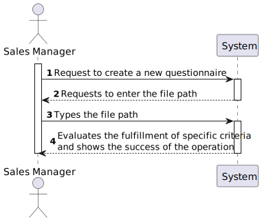

US3001
=======================================

# 1. Requirements

### As Sales Manager, I want to create a new questionnaire to be further answered by customers meeting the specified criteria (e.g.: have ordered a given product; belong to a given age group).

## Document Specifications

## Customer Specifications
> Question: As I understand, the questionnaire will have to be created through the command-line interface of our application and then exported in order for it's grammar to be validated.
Is my interpretation correct?
Can we export it to XML, for example, and validate it's grammar afterwards?
> 
> [Awnser:](https://moodle.isep.ipp.pt/mod/forum/discuss.php?d=16325#p20944) There is no need to import/export data.
Both components should be integrated.
I advice you to talk with technical experts (faculty of Lab classes of course units).
-
> Question: The User Story 3001  refers to the UC 3.3.1 -> "Create a new survey. A survey is characterized by an alphanumeric code, a description, the period( in days) it will be performed, the intended questionnaire, and a set of rules that allows the system to determine the survey target audience."
But what are the constraints to the survey alphanumeric code and the description?
>
> [Awnser:](https://moodle.isep.ipp.pt/mod/forum/discuss.php?d=16357#p20992) 
>> Code: alphanumeric value with 15 chars max; 
>
>> Description: non-empty short sentence (e.g.: 40 chars).
-
> Question: Can you specify / define what business rules are associated to Questionnaire, Section and Question? (Eg: Questionnaire ID only has 9 characters / follows an expression).
>
> [Awnser:](https://moodle.isep.ipp.pt/mod/forum/discuss.php?d=16387#p21043) Basic business rules related with Questionnaire, Section and Question are already available on the specifications document, namely on Table 1, 2 and 3.
Teams must adopt common-sense when applying other criteria such as min/max chars length and support/explain the rationale taken.
-
> Question: When a Section has a Question tagged as "Mandatory" should the section become "Mandatory" as well?
>
> [Awnser:](https://moodle.isep.ipp.pt/mod/forum/discuss.php?d=16388#p21044) The question/answer is not straightforward. However, some consistency/coherence must exist/be assured between the "obligatoriness" of the section and of the question. You must also assure consistency with the "repeatability" information of the section.
Please, check carefully the example provided on section 5.1.3 of the specifications document where you can find "mandatory" sections (e.g.: section 1), "optional" sections (e.g.: section 8) and "condition dependent" sections (e.g.: section 3, 4 and 5). You can also find  "repeatable" sections (e.g.: section 6).
A "mandatory" or "condition dependant" section does not imply any "obligatoriness" on the questions.
An "optional" section implies that all questions are also "optional".
If a question is "mandatory", it means the user needs to answer such question no matter what is stated at the section it appears on.
If a question is "optional", it means that is up to the user to answer or not the question no matter what is stated at the section it appears on.
If a question is "condition dependent", it means the system needs to evaluate the associated condition to determine how to proceed, i.e. as "mandatory" or as "optional" question.
- 
> Question: Can you specify what you mean when a Question/Section is tagged with "condition dependent" and the type of conditions to be set.
>
> [Awnser:](https://moodle.isep.ipp.pt/mod/forum/discuss.php?d=16388#p21044) If the "obligatoriness" of a question/section is "condition dependent", it means it is "mandatory" when the associated condition evaluates as "true" and it is "optional" otherwise.
-
> Question: The same section can be present in more than one questionnaire? The same question can be present in more than one section?
>
> [Awnser:](https://moodle.isep.ipp.pt/mod/forum/discuss.php?d=16401#p21059) Yes, that can happen. However, there is no intend to reutilize questions and/or sections. If that happens, the user will type the question/section again.
-
> Question: When creating a questionnaire should the user give a file with the questionnaire or write each question and section trough the command line?
>
> [Awnser:](https://moodle.isep.ipp.pt/mod/forum/discuss.php?d=16496#p21168) First of all, and to be clear, notice that creating a surveys has two distinct set of data:
>> 1 ) alphanumeric code, a description, the period (in days) it will be performed and a set of rules that allows the system to determine the survey target audience; and
>
>> 2 ) the intended questionnaire, i.e. the title, the welcome message, sections and questions.
> I believe your question concerns the second set of data, right?
> If so, your two options are acceptable. If the file is used, what is really important is the file content and not the file itself.
> Moreover, notice that no matter what option you take, at the end, all the input information must be validated, which includes parsing the data regarding the "intended questionnaire".
- 
> Question: Regarding the creation/validation of a new questionnaire/surveys, what is the expected result after its creation?
For example just store the file loaded with the grammar and generate a html page (suggested by the LPROG PL teacher) as output, or should the application store it in the database for a possible answer in the application?
>
> [Awnser:](https://moodle.isep.ipp.pt/mod/forum/discuss.php?d=16548#p21226) I believe you and your team would find the answers you are looking for if you carefully read and interpret the following available information: 
> 
>> 1 ) section 3.3 of the specifications' document;
>> 2 ) US 3000 and 3001 of Sprint C as well as US 3002 and 3501 of Sprint D (including acceptance criteria).
> 
> Within this scope, at no point is being requested an HTML UI.
> It is also clear that the survey is, first, created then distributed for customers to answer it, answers are further collected and, finally, some statistics will be computed.
> Regarding "... store the file loaded", I recommend you to read previous posts about this topic.
> There is no need to upload file. However, if a file is upload then you should notice that what is really important is not the file but its content.
- 
> Question: In the requested grammar, is it needed to distinguish the different types of questions? For example, if the user says a certain question is multiple choice, shall we make the user input the possible options specifically or do we let the user write the content of the question as he prefers?
>
> [Awnser:](https://moodle.isep.ipp.pt/mod/forum/discuss.php?d=16583#p21275) Well, the question type is need and useful for some reason. 
The way you/your team take (technical) advantage of it is up to you.
I really advice you to debate this issue with technical advisers (i.e. lab classes teachers).
-
> Question: When creating a new Survey can we recycle an already existing questionnaire? And should only the answers be saved, or should the Survey/Questionnaire also be kept?
>
> [Awnser:](https://moodle.isep.ipp.pt/mod/forum/discuss.php?d=16614#p21322)
-
> Question:
>
> [Awnser:]()

## Acceptance Criteria / Comments
The set of questions/answers composing the questionnaire should be expressed and validated (parsed) using the grammar being developed for this purpose.

# 2. Analysis
### Main success scenario
* The user inserts the path of the file, and the system makes evaluates the file's grammar and gives feedback.

## 2.1. System Sequence Diagram

## 2.2. Partial Domain Model

# 3. Design

## 3.1. Functionality realization

## 3.2. Diagrama de Classes

 

# 4. Implementation

**NewQuestionnaireUI**

    package eapli.base.app.backoffice.console.surveymanagement;
    
    import eapli.base.surveymanagement.application.CreateNewQuestionnaireController;
    import eapli.framework.io.util.Console;
    import eapli.framework.presentation.console.AbstractUI;

    /**
    * UI for register a client order to the application.
    *
    * Created by 1201382@isep.ipp.pt & 1201239@isep.ipp.pt
    */

     public class NewQuestionnaireUI extends AbstractUI {
    
     private final CreateNewQuestionnaireController createNewQuestionnaireController = new CreateNewQuestionnaireController();
    
     private Boolean operationError=false;

    @Override
    protected boolean doShow() {

        do{
            try {
                String fileName = Console.readLine("Please insert the file path:");
                createNewQuestionnaireController.createQuestionnaire(fileName);

            } catch(Exception e){
                System.out.println(e.getMessage());
                operationError=true;
            }

        } while(operationError);

        System.out.println("File path entered Successfuly");
        return true;

    }

    @Override
    public String headline() {
        return "Create New Questionnaire";
    }

    }

**CreateNewQuestionnaireController**
   
     package eapli.base.surveymanagement.application;
    
    import eapli.base.surveymanagement.antlr.SurveyLexer;
    import eapli.base.surveymanagement.antlr.eapli.base.surveymanagement.antlr.QuestionnaireVisitor;
    import eapli.base.surveymanagement.antlr.eapli.base.surveymanagement.antlr.SurveyParser;
    import eapli.base.surveymanagement.domain.Questionnaire;
    import eapli.base.usermanagement.domain.BaseRoles;
    import eapli.framework.infrastructure.authz.application.AuthorizationService;
    import eapli.framework.infrastructure.authz.application.AuthzRegistry;
    import org.antlr.v4.runtime.ANTLRInputStream;
    import org.antlr.v4.runtime.CommonTokenStream;
    import org.antlr.v4.runtime.tree.ParseTree;
    import java.io.FileInputStream;
    import java.io.IOException;

    public class CreateNewQuestionnaireController {
    private final AuthorizationService authz = AuthzRegistry.authorizationService();

    public Questionnaire createQuestionnaire(final String file) throws IOException{
        authz.ensureAuthenticatedUserHasAnyOf(BaseRoles.SALES_MANAGER, BaseRoles.POWER_USER, BaseRoles.ADMIN, BaseRoles.WAREHOUSE_EMPLOYEE);

        FileInputStream fis = new FileInputStream(file);
        SurveyLexer lexer = new SurveyLexer(new ANTLRInputStream(fis));
        CommonTokenStream tokens = new CommonTokenStream(lexer);
        SurveyParser parser = new SurveyParser(tokens);
        ParseTree tree = parser.start(); // parse
        QuestionnaireVisitor quest = new QuestionnaireVisitor();
        Questionnaire questionnaire = (Questionnaire) quest.visit(tree);

        System.out.println(questionnaire);

        return null;

    }
    }

# 5. Observations
* When running through the UI, some errors appeared however in the antlr preview the questionnaire complies with the rules.

# 6. Demo
### UI

### ANTLR preview teste

### ANTLR preview teste1

