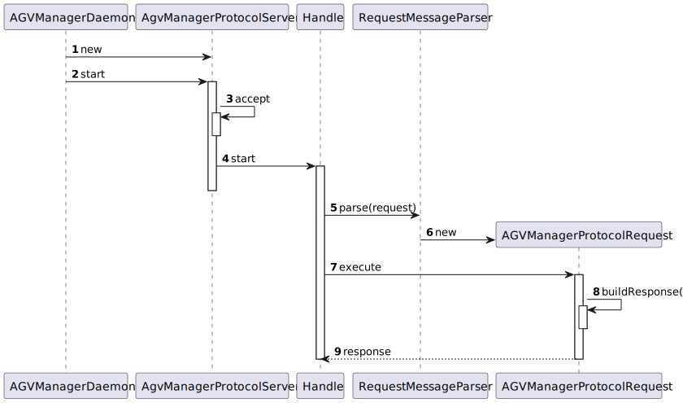
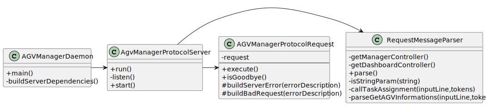

US4001
=======================================

# 1. Requirements

###  As Project Manager, I want that the "AGVManager" component supports properly, at request, the needs of the "BackOfficeApp" application as well as the needs the AGV digital twin.

## Customer Specifications

> Question: Should DLength1 and Dlength2 be generated randomly? Or should we generate one first and then calculate the other?
>
> [Awnser:](https://moodle.isep.ipp.pt/mod/forum/discuss.php?d=16713#p21443) believe that you mean "D_Length_1" and "D_Length_1" of the SPOMS protocol, right? If this is right, the answer is no. You have to compute such values.
-
> Question: Regarding the USs 1901,4001, 5001, and 5002, what would you consider its complete state, that is, what would be the criterion to define whether or not this US is functional?
>
> [Awnser:](https://moodle.isep.ipp.pt/mod/forum/discuss.php?d=16437#p21096) For all of those US, the communication between the two involved components must be implemented in accordance with the SPOMS2022. The requests processing can be somehow mocked. For instance, if processing a request implies saving some data to the database, the component can instead write such data to a log (mocking). Latter, on next sprint, the teams implement the interaction to the database.
However, it is not advisable mocking everything, namely the components (internal) state. Notice that by mocking you are letting extra effort to the next sprint.

# Design

## Functionality realization
### Sequence Diagram

### Class Diagram

# Used Patterns
- Controller
- Creator
- Repository
- Factory

# Observations

*The followed RCOMP TCP Server Component was based on the provided eCafetaria Repository, made available by the EAPLI Unit Course.*

# Relevant Remarks
* As this US is connected to US4002, it was carried out in collaboration with franciscoredol<1201239@isep.ipp.pt>
	 

