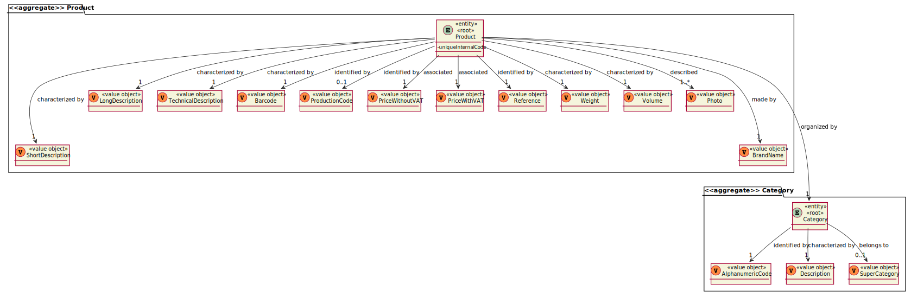
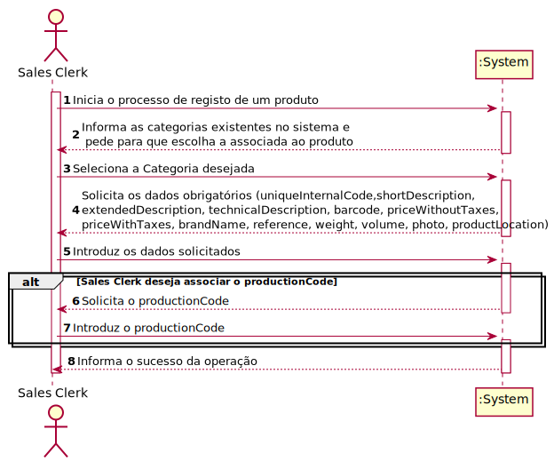
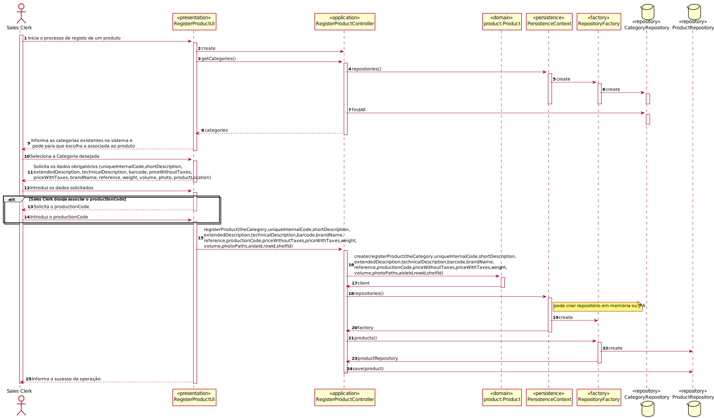
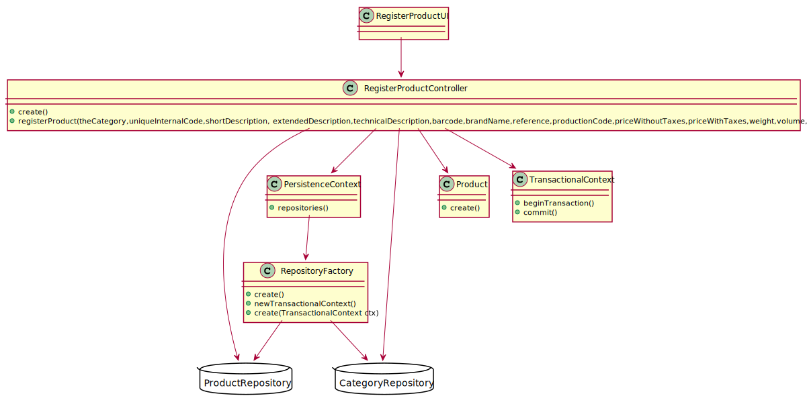

# US1001

# 1. Requisitos
_____
**US1001** As Sales Clerk, I want to specify a new product for sale.

### 1.1 Especificações e esclarecimentos do cliente

> [Question:](https://moodle.isep.ipp.pt/mod/forum/discuss.php?d=15843#p20354)
> Regarding the measures of the product what are the units of measurement that should be supported?
>
> [Awnser:](https://moodle.isep.ipp.pt/mod/forum/discuss.php?d=15843#p20397)
> The width, length and height of a product is specified in millimeters; 
> The weight of the product is specified in grams.

> [Question:](https://moodle.isep.ipp.pt/mod/forum/discuss.php?d=15843#p20354)
  Regarding the barcode of the product should an image be generated or only the code be saved?
>  
> [Awnser:](https://moodle.isep.ipp.pt/mod/forum/discuss.php?d=15843#p20384)
  No image is required to be generated.

> [Question:](https://moodle.isep.ipp.pt/mod/forum/discuss.php?d=15740#p20234)
Does the project support more than 1 currency, and if so which currencies should it support?
>
> [Awnser:](https://moodle.isep.ipp.pt/mod/forum/discuss.php?d=15740#p20253)
>
>Yes! The project must be prepared to easily support several currencies. 
> 
>The system should work adopting a base currency (e.g.: EUR) and, according to the customer location, be able to present prices on other currencies (e.g. USD) using an external currency converter.

> [Question:](https://moodle.isep.ipp.pt/mod/forum/discuss.php?d=15970#p20501)
Given that all the units of a product are located in a single warehouse, should in the moment of creation of the product the sales clerk chose one of the available?
>
> [Awnser:](https://moodle.isep.ipp.pt/mod/forum/discuss.php?d=15970#p20522)
Yes, the product location might be specified during US 1001.

# 2. Análise
_____

### 2.1 Excerto do Modelo de Domínio

### 2.2 System Sequence Diagram

# 3. Design
_____

## 3.1. Realização da Funcionalidade

## 3.2. Diagrama de Classes

### 3.3. Padrões Aplicados

Foram aplicados os princípios SOLID e os padrões de design de software GoF. Sendo o que exigiu maior pensamento e reflexão sobre se faria sentido aplicar foi o Builder.

### 3.4. Testes 

**Teste 1:** Verificar que não é possível criar uma instância da classe Client sem os valores obrigatórios.

    @Test
    public void ensureProductWithNameEmailPhoneNumberVatAndPostalAddress() {
        photos.add(photo);
        new Product(category,uniqueInternalCode,shortDescription,extendedDescription,technicalDescription,barcode,brandName,reference,priceWithout,priceWith,15.00,30.00,photos,1L,1L,1L);
        assertTrue(true);
    }

    @Test(expected = IllegalArgumentException.class)
    public void ensureMustHaveUniqueInternalCode() {
        photos.add(photo);
        new Product(category,new UniqueInternalCode(null),shortDescription,extendedDescription,technicalDescription,barcode,brandName,reference,priceWithout,priceWith,15.00,30.00,photos,1L,1L,1L);
    }

    @Test(expected = IllegalArgumentException.class)
    public void ensureMustHaveShortDescription() {
        photos.add(photo);
        new Product(category,uniqueInternalCode,new ShortDescription(null),extendedDescription,technicalDescription,barcode,brandName,reference,priceWithout,priceWith,15.00,30.00,photos,1L,1L,1L);
    }

    @Test(expected = IllegalArgumentException.class)
    public void ensureMustHaveExtendedDescription() {
        photos.add(photo);
        new Product(category,uniqueInternalCode,shortDescription,new ExtendedDescription(null),technicalDescription,barcode,brandName,reference,priceWithout,priceWith,15.00,30.00,photos,1L,1L,1L);
    }

    @Test(expected = IllegalArgumentException.class)
    public void ensureMustHaveTechnicalDescription() {
        photos.add(photo);
        new Product(category,uniqueInternalCode,shortDescription,extendedDescription,new TechnicalDescription(null),barcode,brandName,reference,priceWithout,priceWith,15.00,30.00,photos,1L,1L,1L);
    }

    @Test(expected = IllegalArgumentException.class)
    public void ensureMustHaveBarcode() {
        photos.add(photo);
        new Product(category,uniqueInternalCode,shortDescription,extendedDescription,technicalDescription,new Barcode(null),brandName,reference,priceWithout,priceWith,15.00,30.00,photos,1L,1L,1L);
    }

    @Test(expected = IllegalArgumentException.class)
    public void ensureMustHaveBrandName() {
        photos.add(photo);
        new Product(category,uniqueInternalCode,shortDescription,extendedDescription,technicalDescription,barcode,new BrandName(null),reference,priceWithout,priceWith,15.00,30.00,photos,1L,1L,1L);
    }

    @Test(expected = IllegalArgumentException.class)
    public void ensureMustHaveReference() {
        photos.add(photo);
        new Product(category,uniqueInternalCode,shortDescription,extendedDescription,technicalDescription,barcode,brandName,new Reference(null),priceWithout,priceWith,15.00,30.00,photos,1L,1L,1L);
    }

    @Test(expected = IllegalArgumentException.class)
    public void ensureMustPhoto() {
        photos.add(photo);
        new Product(category,uniqueInternalCode,shortDescription,extendedDescription,technicalDescription,barcode,brandName,new Reference(null),priceWithout,priceWith,15.00,30.00,photos,1L,1L,1L);
    }

# 4. Implementação

## 4.1 RegisterProductController

    public class RegisterProductController {

    private final AuthorizationService authz = AuthzRegistry.authorizationService();
    private final ProductRepository productRepository = PersistenceContext.repositories().products();
    private final CategoryRepository categoryRepository = PersistenceContext.repositories().category();

    public Iterable<Category> getCategories() {
        return categoryRepository.findAll();
    }

    public Product registerProduct(final Category category,final String uniqueInternalCode, final String shortDescription, final String extendedDescription, final String technicalDescription,final String barcode,final String brandName,final String reference, final String productionCode,final double priceWithoutTaxes, final double priceWithTaxes, final Double weight, final Double volume, final Set<String> photos, final Long aisleId, final Long rowId, final Long shelfId) {

        authz.ensureAuthenticatedUserHasAnyOf(BaseRoles.POWER_USER, BaseRoles.SALES_CLERK);

        Set<Photo> photoSet = new HashSet<>();

        for (String path: photos){
            photoSet.add(new Photo(path));
        }

        Product newProduct = new Product(category,new UniqueInternalCode(uniqueInternalCode), new ShortDescription(shortDescription),new ExtendedDescription(extendedDescription),new TechnicalDescription(technicalDescription),new Barcode(barcode), new BrandName(brandName),new Reference(reference),Money.euros(priceWithoutTaxes), Money.euros(priceWithTaxes), weight, volume,photoSet,rowId,shelfId,aisleId);

        if(productionCode != null){
            newProduct.addProductionCode(new ProductionCode(productionCode));
        }
        return productRepository.save(newProduct);
        }

    }

_____

# 5. Integração/Demonstração

Esta User Story foi implementada na totalidade tendo dependências com a user story de registo de categorias.

_____

# 6. Observações
_____

