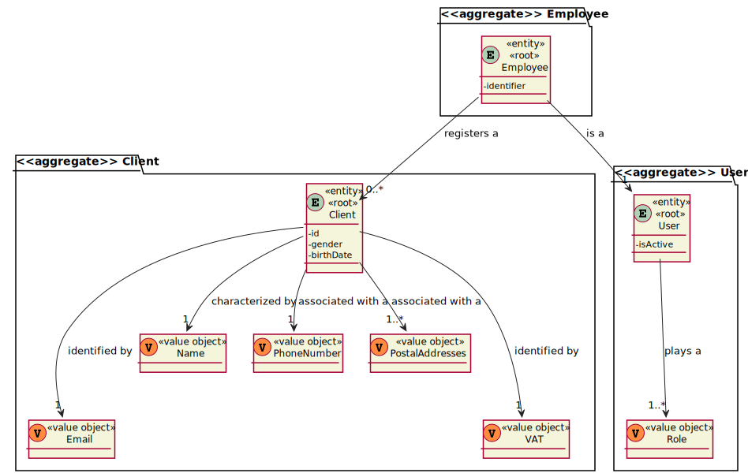
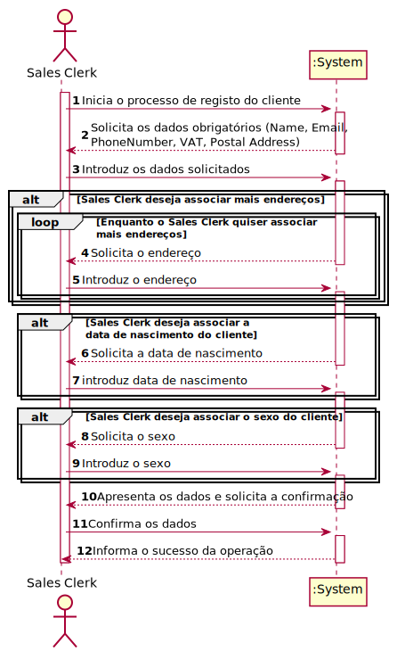
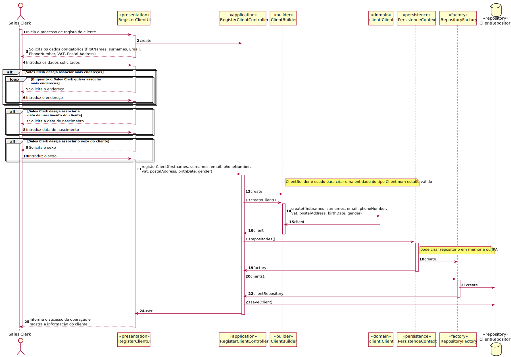
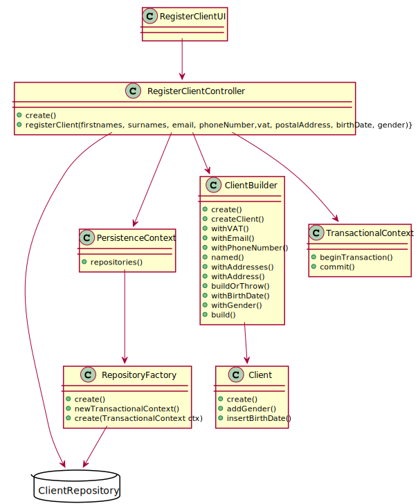

# US1003

# 1. Requisitos

**US1003** As Sales Clerk, I want to register a new customer.

### 1.1 Especificações e esclarecimentos do cliente

> [Question:](https://moodle.isep.ipp.pt/mod/forum/discuss.php?d=15754#p20248)
  Name - should we consider first name, last name or is there anything more worth capturing? Are there length restrictions?
>
> [Answer:](https://moodle.isep.ipp.pt/mod/forum/discuss.php?d=15754#p20258)
  At least a first and last name is required. Although, desirably the customer should specify his/her full name. Considering this, apply the min/max length you consider as reasonable to meet this requirement.

> [Question:](https://moodle.isep.ipp.pt/mod/forum/discuss.php?d=15754#p20248)
  VAT ID - which length should it have? Is it only digits or could there be letters?
>
> [Answer:](https://moodle.isep.ipp.pt/mod/forum/discuss.php?d=15754#p20258)
  VAT ID varies from one country to another. Usually it has letters and numbers (cf. here). The system must be prepared to support/recognize several VAT Ids.

> [Question:](https://moodle.isep.ipp.pt/mod/forum/discuss.php?d=15754#p20248)
  Phone number: which lenght/format?
>
> [Answer:](https://moodle.isep.ipp.pt/mod/forum/discuss.php?d=15754#p20258)
  Phone number: according to international standards (e.g.: +351 934 563 123).

> [Question:](https://moodle.isep.ipp.pt/mod/forum/discuss.php?d=15754#p20248)
  Birthday - in which format?
>
> [Answer:](https://moodle.isep.ipp.pt/mod/forum/discuss.php?d=15754#p20258)
  Birthday: it is a date... you can adopt year/month/day.

> [Question:](https://moodle.isep.ipp.pt/mod/forum/discuss.php?d=15754#p20248)
  Address - What kind of format are we expecting for these? Street name, door number, postal code, city, country is a valid format or are we missing anything?
>
> [Answer:](https://moodle.isep.ipp.pt/mod/forum/discuss.php?d=15754#p20258)
  Address: I think you said it all.

> [Question:](https://moodle.isep.ipp.pt/mod/forum/discuss.php?d=15749#p20243)
When creating a customer, should it be automatically associated with a login, that is, when entering its data, such as name, 
> and so it is necessary to enter a username and a password?
>
> [Answer:](https://moodle.isep.ipp.pt/mod/forum/discuss.php?d=15749#p20255)
A clerk is registering customers either manually or by importing files (cf. Use Case 3.1.4b and 3.1.4c respectively). 
> In this scenario no account activation process is required and/or performed. Moreover, by default, no customer credentials are to be generated. If such credentials are needed, the clerk undergoes on another use case (cf. Use Case 3.1.5).

# 2. Análise

### 2.1 Excerto do Modelo de Domínio

### 2.2 System Sequence Diagram

# 3. Design

## 3.1. Realização da Funcionalidade

## 3.2. Diagrama de Classes

## 3.3. Padrões Aplicados

Foram aplicados os princípios SOLID e os padrões de design de software GoF. Sendo o que exigiu maior pensamento e reflexão sobre se faria sentido aplicar foi o Builder.

### Builder
- O padrão Builder é usado para encapsular a lógica de construção de um objeto. Foi utilizado devido à criação do Cliente envolver vários atributos opcionais, existindo assim representações múltiplas da classe.

## 3.4. Testes 

**Teste 1:** Verificar que não é possível criar uma instância da classe Client sem os valores obrigatórios.

	@Test(expected = IllegalArgumentException.class)
    public void ensureMustHaveName() {
        postalAddresses.add(CLIENT_POSTAL_ADDRESS);
        new Client(null,CLIENT_VAT,CLIENT_EMAIL,CLIENT_PHONE_NUMBER,postalAddresses);
    }

    @Test(expected = IllegalArgumentException.class)
    public void ensureMustHaveVat() {
        postalAddresses.add(CLIENT_POSTAL_ADDRESS);
        new Client(CLIENT_NAME,null,CLIENT_EMAIL,CLIENT_PHONE_NUMBER,postalAddresses);
    }

    @Test(expected = IllegalArgumentException.class)
    public void ensureMustHaveEmail() {
        postalAddresses.add(CLIENT_POSTAL_ADDRESS);
        new Client(CLIENT_NAME,CLIENT_VAT,null,CLIENT_PHONE_NUMBER,postalAddresses);
    }

    @Test(expected = IllegalArgumentException.class)
    public void ensureMustHavePhoneNumber() {
        postalAddresses.add(CLIENT_POSTAL_ADDRESS);
        new Client(CLIENT_NAME,CLIENT_VAT,CLIENT_EMAIL,null,postalAddresses);
    }

    @Test(expected = IllegalArgumentException.class)
    public void ensureMustHavePostalAddress() {
        new Client(CLIENT_NAME,CLIENT_VAT,CLIENT_EMAIL,CLIENT_PHONE_NUMBER,null);
    }

# 4. Implementação

## 4.1 ClientBuilder

    public ClientBuilder named(final Name name) {
        this.name = name;
        return this;
    }

    public ClientBuilder withVAT(final VAT vat) {
        this.vat = vat;
        return this;
    }

    public ClientBuilder withEmail(final Email email) {
        this.email = email;
        return this;
    }

    public ClientBuilder withPhoneNumber(final PhoneNumber phoneNumber) {
        this.phoneNumber = phoneNumber;
        return this;
    }

    public ClientBuilder withAddresses(final Set<PostalAddress> postalAddresses) {
        if (postalAddresses != null) {
            postalAddresses.forEach(this::withAddress);
        }
        return this;
    }

    public ClientBuilder withAddress(final PostalAddress postalAddress) {
        this.postalAddresses.add(postalAddress);
        return this;
    }

    private Client buildOrThrow() {
        if (theClient != null) {
            return theClient;
        } else if (name != null && vat != null && email != null && phoneNumber != null && !postalAddresses.isEmpty()) {
            theClient = new Client(name, vat, email, phoneNumber, postalAddresses);
            return theClient;
        } else {
            throw new IllegalStateException();
        }
    }

    public ClientBuilder withGender(final Client.Gender gender) {
        if (gender != null){
            buildOrThrow();
            theClient.addGender(gender);
        }
        return this;
    }

    public ClientBuilder withBirthdate(final Calendar birthdate) {
        if (birthdate != null){
            buildOrThrow();
            theClient.insertBirthDate(birthdate);
        }
        return this;
    }

    @Override
    public Client build() {
        final Client ret = buildOrThrow();
        theClient = null;
        return ret;
    }

# 5. Integração/Demonstração

Esta User Story foi implementada na totalidade tendo dependências com a user story de registo de categorias.

# 6. Observações

Futuramente o sales clerk terá uma opção que será de gerar as credenciais para o cliente tornando-o um utilizador do sistema.

