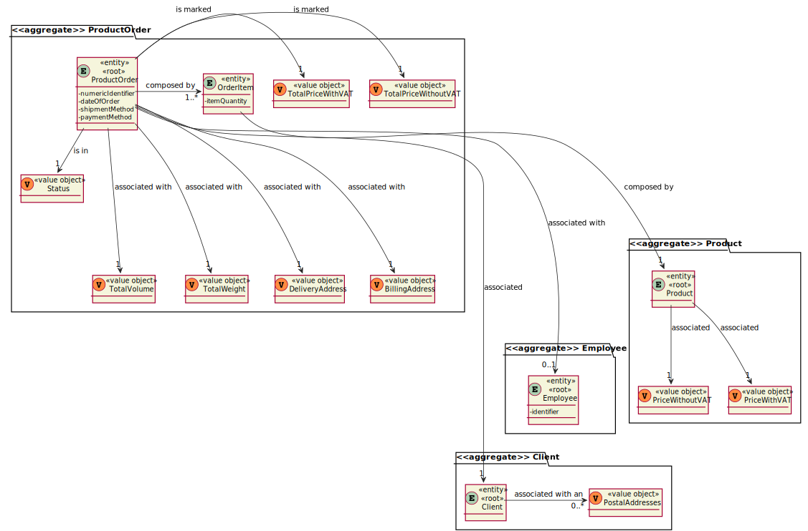
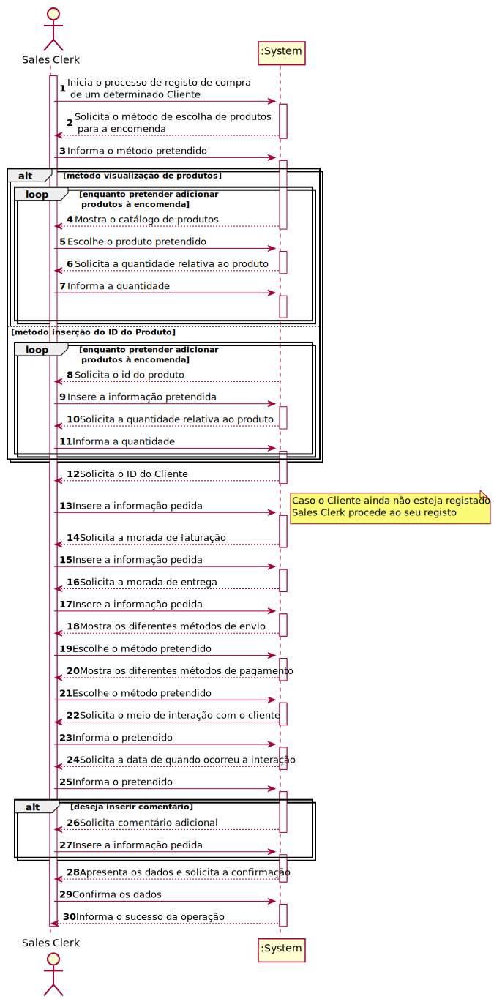
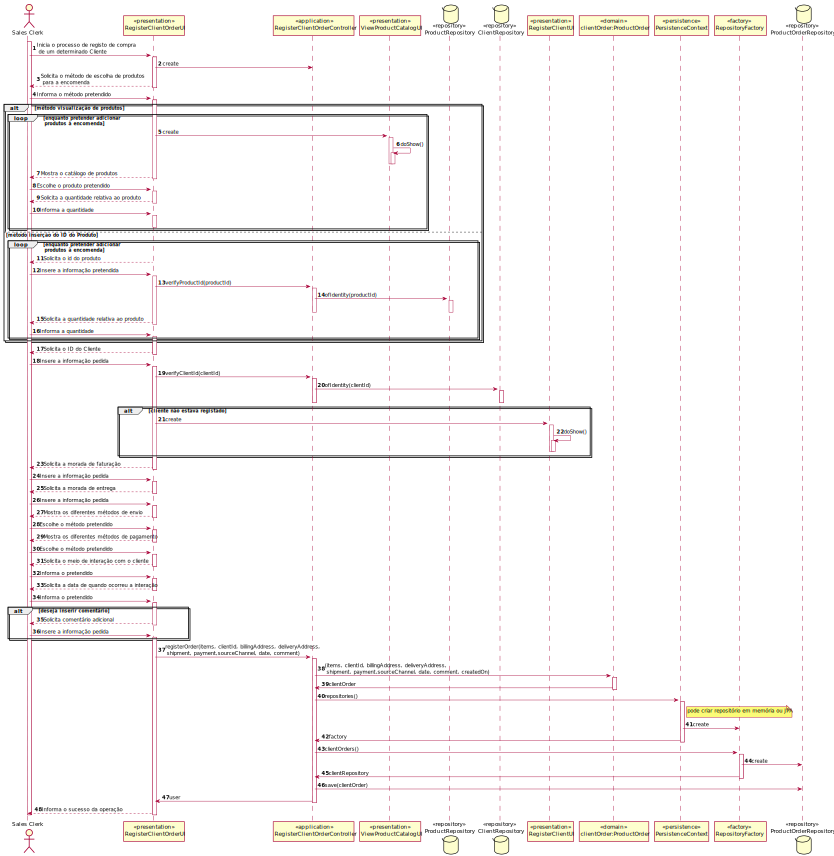
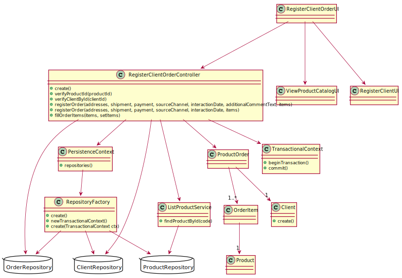

# US1004

# 1. Requisitos

**US1004** As Sales Clerk, I want to create a new products order on behalf of a given customer.

### 1.1 Especificações e esclarecimentos do cliente

>[Question:](https://moodle.isep.ipp.pt/mod/forum/discuss.php?d=15531)
The development team wonders if the order volume and weight should be a calculated based on the products entered in it?
>
>[Answer:](https://moodle.isep.ipp.pt/mod/forum/discuss.php?d=15531)
Regarding volume, for now, adopt a very basic algorithm to compute the approximate overall volume.

>[Question:](https://moodle.isep.ipp.pt/mod/forum/discuss.php?d=15532)
The development team wonders if shipping methods may change over time? If yes, could this affect past orders?
>
>[Answer:](https://moodle.isep.ipp.pt/mod/forum/discuss.php?d=15532)
As suggested in the specifications' document, during the prototype development, there is no will to devote relevant effort on this matter (cf. page 3).
Information regarding shipping methods might change over time (e.g.: the cost).
No change can affect the information of past orders.

>[Question:](https://moodle.isep.ipp.pt/mod/forum/discuss.php?d=15630)
We have the knowledge that the clerk can create a order on behalf of a given costumer and with that the system might request additional information regarding the source order information, on the project descriptions gives the example of phone number, email and others.
What additional information do you need more?
>
>[Answer:](https://moodle.isep.ipp.pt/mod/forum/discuss.php?d=15630)
Regarding that topic, it is import to recall the following:
"At least for some organizations, it is also important that the system allows sales department clerks to create orders on behalf of a given customer. Thus, the system should collect the required information to distinguish between those orders registered directly by the customer and the ones registered by a clerk. In the latter case, due trackability concerns, the system should be able (at least) to identify the respective clerk."
Despite identifying the clerk registering the order, it is important to register (i) the source channel (e.g.: phone, email, meeting, etc...), (ii) the date/time when such interaction happen and (iii) optionally add some comment.

>[Question:](https://moodle.isep.ipp.pt/mod/forum/discuss.php?d=15646)
Q1: Should the shipment method price be managed later on by the company or it's a constant value that doesn't require future management?
Q2: Should the system be able to add more payment methods later on or are those payments always automatically received and have no verification needed?
>
>[Answer:](https://moodle.isep.ipp.pt/mod/forum/discuss.php?d=15646)
A1: Yes, the shipment price varies from one method to another. Thus, an option to manage such information will be required. But, such development is currently out of scope.
A2: Yes. Multiple  payment methods can be added/supported. Currently, the team just need to be aware that is an extension point and prepare the system for that.

>[Question:](https://moodle.isep.ipp.pt/mod/forum/discuss.php?d=15708)
Is it required that the system keep an history of the order state? For example, if an order changes from "payment pending" to "to be prepared", are we required to keep the date of this change for future query?
>
>[Answer:](https://moodle.isep.ipp.pt/mod/forum/discuss.php?d=15708)
Keeping order state history, as suggested, is an interesting feature that will be highly appreciated/valued.

>[Question:](https://moodle.isep.ipp.pt/mod/forum/discuss.php?d=15740)
Does the project support more than 1 currency, and if so which currencies should it support?
>
>[Answer:](https://moodle.isep.ipp.pt/mod/forum/discuss.php?d=15740)
Yes! The project must be prepared to easily support several currencies.
The system should work adopting a base currency (e.g.: EUR) and, according to the customer location, be able to present prices on other currencies (e.g. USD) using an external currency converter.
During the prototype development, using a currency converter should not be a major concern.

>[Question:](https://moodle.isep.ipp.pt/mod/forum/discuss.php?d=15938)
Question 1: How will the customer pay for the order placed by the clerk. Will receive a notification?
Question 2: After placing the order will the system notify the customer? If so, how?
Question 3: How do you want the clerk to select the products? By putting their id or selecting?
>
>[Answer:](https://moodle.isep.ipp.pt/mod/forum/discuss.php?d=15938)
Question 1: How will the customer pay for the order placed by the clerk. Will receive a notification?
For now, you may assume the clerk selects one of the available payment methods and types the required information.
Yet, I would like to emphasise what is stated in the specifications document:
"While developing the system prototype, these two issues (i.e.: shipment and payment) must be considered. Although, since both are not perceived as representing a risk to the project, the shipment cost computation, and the connections to external systems (e.g.: carriers and payment services) should be mock."
>
>Question 2: After placing the order will the system notify the customer? If so, how?
That is a good idea... the system might send a notification email to the customer.
This functionality will be seen as an asset to distinguish the solutions presented by different development teams.
>
>Question 3: How do you want the clerk to select the products? By putting their id or selecting?
>
>Both: by typing the product id when knowing it or by using searching/browsing the products catalog (US1002).

>[Question:](https://moodle.isep.ipp.pt/mod/forum/discuss.php?d=15962)
Regarding US1004 when a sales clerk creates a new order for a given customer, does the customer need to be registered in the system?
>
>[Answer:](https://moodle.isep.ipp.pt/mod/forum/discuss.php?d=15962)
Most of the times, the customer is already registered.
However, it might happen (s)he is not registered. In such case, the customer is registered on that moment using US1003.

# 2. Análise

### 2.1 Excerto do Modelo de Domínio

### 2.2 System Sequence Diagram

# 3. Design

## 3.1. Realização da Funcionalidade

## 3.2. Diagrama de Classes

## 3.3. Padrões Aplicados

Foram aplicados os princípios SOLID e os padrões de design de software GoF. Sendo o que exigiu maior pensamento e reflexão sobre se faria sentido aplicar foi o Builder.

### Builder
- O padrão Builder é usado para encapsular a lógica de construção de um objeto. Neste sprint não foi utilizado mas dependendo de próximas user stories poderá fazer sentido utilizar devido à criação do ProductOrder poder passar a envolver vários atributos opcionais, existindo assim representações múltiplas da classe.

## 3.4. Testes 
*Nesta secção deve sistematizar como os testes foram concebidos para permitir uma correta aferição da satisfação dos requisitos.*

**Teste 1:** Verificar que não é possível criar uma order item sem código associado a produto nem quantidade.

	@Test(expected = IllegalArgumentException.class)
    public void ensureOrderItemHasCode() {
        new OrderItem( 1, null);
    }

- Relativamente à quantidade nem é possível testar pois dá erro de compilação.

# 4. Implementação

## 4.1 RegisterClientOrderController

    public class RegisterClientOrderController {

    private final AuthorizationService authz = AuthzRegistry.authorizationService();
    private final ClientRepository clientRepository = PersistenceContext.repositories().client();
    private ListProductService listProductService = new ListProductService();

    private Client client;
    private Set<OrderItem> orderItems = new HashSet<>();

    public ProductOrder registerOrder(Map<String,Integer> items, List<List<String>> addresses, Shipment shipment, ProductOrder.SourceChannel sourceChannel, Calendar interactionDate, String additionalComment, ProductOrder.Payment payment){
        authz.ensureAuthenticatedUserHasAnyOf(BaseRoles.POWER_USER, BaseRoles.SALES_CLERK);
        fillOrderItems(items,orderItems);
        ProductOrder order = new ProductOrder(client, new Address(addresses.get(0).get(0), addresses.get(0).get(1),addresses.get(0).get(2), addresses.get(0).get(3), addresses.get(0).get(4)), new Address(addresses.get(1).get(0), addresses.get(1).get(1),addresses.get(1).get(2), addresses.get(1).get(3), addresses.get(1).get(4)),shipment,sourceChannel,interactionDate,new AdditionalComment(additionalComment), authz.session().get().authenticatedUser(),orderItems,payment);
        PersistenceContext.repositories().orders().save(order);
        return order;
    }

    public ProductOrder registerOrder(Map<String,Integer> items,List<List<String>> addresses, Shipment shipment, ProductOrder.SourceChannel sourceChannel, Calendar interactionDate, ProductOrder.Payment payment){
        authz.ensureAuthenticatedUserHasAnyOf(BaseRoles.POWER_USER, BaseRoles.SALES_CLERK);
        fillOrderItems(items,orderItems);
        ProductOrder order = new ProductOrder(client, new Address(addresses.get(0).get(0), addresses.get(0).get(1),addresses.get(0).get(2), addresses.get(0).get(3), addresses.get(0).get(4)), new Address(addresses.get(1).get(0), addresses.get(1).get(1),addresses.get(1).get(2), addresses.get(1).get(3), addresses.get(1).get(4)),shipment,sourceChannel,interactionDate, authz.session().get().authenticatedUser(),orderItems,payment);
        PersistenceContext.repositories().orders().save(order);
        return order;
    }

    public boolean verifyClientById(Long clientId) {
        Optional<Client> chosenClient = clientRepository.ofIdentity(clientId);
        if(chosenClient.isPresent()) {
           client = chosenClient.get();
        }
        return chosenClient.isPresent();
    }

    public boolean verifyProductById(UniqueInternalCode code) {
        Product chosenProduct = listProductService.findProductByUniqueInternalCode(code);

        return chosenProduct != null;
    }

    private void fillOrderItems(Map<String, Integer> items, Set<OrderItem> setItems) {

        for (Map.Entry<String, Integer> entry : items.entrySet()) {
            String code = entry.getKey();
            Integer quantity = entry.getValue();
            OrderItem orderItem = new OrderItem(quantity,code);
            setItems.add(orderItem);
        }
    }

    }
# 5. Integração/Demonstração

Esta User Story tem dependências com a user story de registo de produtos, de clientes e a de visualizar o catálogo de produtos, tendo, devido ao trabalho em equipa, sido implementada com sucesso.

# 6. Observações

Futuramente o itemOrder passará a ser uma entidade, mas por erros relacionados com persistir a informação na base de dados e a não ter conseguido resolver o erro
e de maneira que a user story ficasse funcional de momento é um value object.

Alteração a ser realizada no sprint C.

