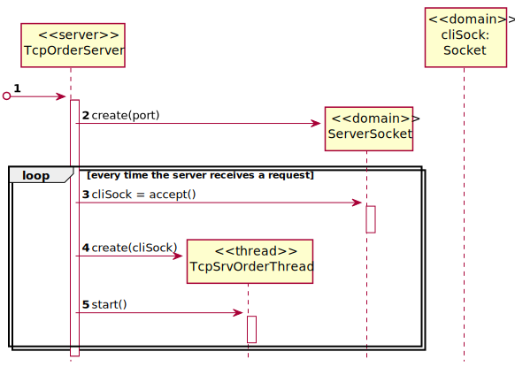

# US1901

# 1. Requisitos

**US1901** As Project Manager, I want that the "OrdersServer" component supports properly, at request, the needs of the "CustomerApp" application.

## 2.1. Sequence Diagram - Server

# 3.  Fluxo de Troca de Mensagens

1. **Espera** pela mensagem do **Cliente** com o **Código COMMTEST (0)**.
2. **Manda** ao **Cliente** o **Código ACK (2)**.
3. **Espera** pela mensagem do **Cliente** com a informação que precisa obter.
4. **Envia** as informações pedidas ao **Cliente**.
5. **Espera** pela mensagem do **Cliente** com o **Código de Fim (1)**.
6. **Manda** ao **Cliente** o **Código de Entendido (2)**.
7. **Fecha** o Socket.

* (**NOTA**: Caso exista algum problema durante a troca de mensagens o **socket é fechado**)

| Código | Request  |
|--------|-------|
| 3      | Verificar se o Produto desejado existe |
| 4      | Mostrar Catálogo de Produtos |
| 5      | Adicionar o Produto ao Carrinho de Compras|
# 4. Implementação

* Foi utilizado o **Protocolo de Comunicação SPOMSP 2022 - Smart Products Order System Protocol**.

# 5. Integração/Demonstração

* Esta US está relacionada com a US1501.

# 6. Observações

* Foram realizados esforços constantes para que todas as implementações sejam integradas da forma mais coerente, levando a que programa se apresente coeso.
