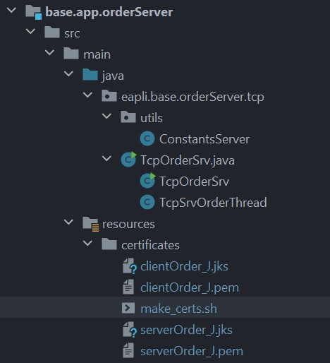

# US1902

# 1. Requisitos

As Project Manager, I want the communications made through the SPOMS2022 protocol to be secured/protected.

**Acceptance Criteria**:

- It should be adopted SSL/TLS with mutual authentication based on public key certificates.
  It complements the US1901.

# 2. Análise

* Para garantir que as comunicações realizadas entre o Costumer Application
e o Order Server são seguras e protegidas foi utilizado o protocolo SSL/TLS, garantindo assim que
a autenticação e a privacidade são impostas na camada de transporte.

# 3. Dados do Server e Certificados

## 3.1. Certificados Utilizados

- Os certificados utilizados para o servidor e para o cliente foram gerados através do 'script' make_certs.sh que se encontra na pasta "Projeto Java/base.app.orderServer/src/main/resources/certificates/make_certs.sh".

# 4. Implementação

## TcpOrderSrv

    public class TcpOrderSrv {

    static final int SERVER_PORT=10000;
    static final String TRUSTED_STORE= "C:\\Users\\arian\\OneDrive - Instituto Superior de Engenharia do Porto\\Desktop\\lei21_22_s4_2de_01\\Projeto Java\\certificates\\serverOrder_J.jks";
    static final String KEYSTORE_PASS="forgotten";

    /*
    static ServerSocket sock;
     */

    public static void main(String args[]) throws Exception {
        SSLServerSocket sock=null;
        Socket cliSock;

        // Trust these certificates provided by authorized clients
        System.setProperty("javax.net.ssl.trustStore", TRUSTED_STORE);
        System.setProperty("javax.net.ssl.trustStorePassword",KEYSTORE_PASS);

        // Use this certificate and private key as server certificate
        System.setProperty("javax.net.ssl.keyStore",TRUSTED_STORE);
        System.setProperty("javax.net.ssl.keyStorePassword",KEYSTORE_PASS);

        SSLServerSocketFactory sslF = (SSLServerSocketFactory) SSLServerSocketFactory.getDefault();

        try {
            sock = (SSLServerSocket) sslF.createServerSocket(SERVER_PORT);
            sock.setNeedClientAuth(true);
        }
        catch(IOException ex) {
            System.out.println("Failed to open server socket");
            System.exit(1);
        }

        while(true) {
            cliSock=sock.accept();
            new Thread(new TcpSrvOrderThread(cliSock)).start();
        }
    }
    }

    class TcpSrvOrderThread implements Runnable {
    private Socket s;

    private final ListProductDTOService service = new ListProductDTOService();
    private final ProductRepository productRepository = PersistenceContext.repositories().products();
    private final ClientRepository clientRepository = PersistenceContext.repositories().client();
    private final ShoppingCarRepository shoppingCarRepository = PersistenceContext.repositories().shoppingCar();
    private final OrderRepository orderRepository = PersistenceContext.repositories().orders();
    private final ListQuestionnaireDTOService listQuestionnaireDTOService = new ListQuestionnaireDTOService();
    private Product product;
    private Optional<Client> client;
    private Optional<ShoppingCar> shoppingCar;
    private final AnswerRepository answerRepository = PersistenceContext.repositories().answers();
    private final SurveyRepository surveyRepository = PersistenceContext.repositories().surveys();

    public TcpSrvOrderThread(Socket cli_s) {
        s = cli_s;
    }

    public void run() {
        InetAddress clientIP;

        try {

            clientIP = this.s.getInetAddress();
            System.out.println("[INFO] Nova conexão de cliente: " + clientIP.getHostAddress() + ", porta: " + this.s.getPort() + ".");

            DataInputStream sIn = new DataInputStream(this.s.getInputStream());
            DataOutputStream sOut = new DataOutputStream(this.s.getOutputStream());

            byte[] clientMessage = sIn.readNBytes(4);

            if (clientMessage[1] == ConstantsServer.START_CODE) {
                System.out.println("[SUCCESS] Código de Teste (0) do Cliente recebido.");

                MessageUtils.writeMessage((byte) 2,sOut);
                System.out.println("[INFO] A Mandar Código de Entendido (2) ao Cliente.");

                byte[] clientMessageUS = new byte[4];
                MessageUtils.readMessage(clientMessageUS, sIn);

                /*============Enviar produtos ao cliente============*/
                if(clientMessageUS[1] == ConstantsServer.SEND_PRODUCTS) {
                    ObjectOutputStream sOutputObject = new ObjectOutputStream(this.s.getOutputStream());

                    Iterable<ProductDTO> productCatalog = service.allProducts();
                    sOutputObject.writeObject(productCatalog);
                    sOutputObject.flush();
                }

                /*============Verificar se Produto Existe============*/
                if(clientMessageUS[1] == ConstantsServer.PRODUCT_EXISTS) {
                    String productUniqueInternalCode = MessageUtils.getDataFromMessage(clientMessageUS,sIn);
                    product = productRepository.findByUniqueInternalCode(UniqueInternalCode.valueOf(productUniqueInternalCode));
                    if(product == null) {
                        MessageUtils.writeMessageWithData((byte) 3, "[FAILURE] Product not found! Please try again.", sOut);
                    } else {
                        MessageUtils.writeMessageWithData((byte) 3, "[SUCCESS] Product found!", sOut);
                    }
                }

                /*============Adicionar Produto ao Carrinho de Compras============*/
                if(clientMessageUS[1] == ConstantsServer.SHOPPINGCAR_ADD) {
                    String info = MessageUtils.getDataFromMessage(clientMessageUS,sIn);
                    String[] array = info.split(" ");
                    String quantidade = array[0];
                    String email = array[1];
                    String productUniqueInternalCode = array[2];
                    product = productRepository.findByUniqueInternalCode(UniqueInternalCode.valueOf(productUniqueInternalCode));
                    client = clientRepository.findByEmail(Email.valueOf(email));
                    ShopCarItem item = new ShopCarItem(Integer.parseInt(quantidade),product);
                    if(client.isPresent()) {
                        shoppingCar = shoppingCarRepository.findByClient(client.get());
                        if(shoppingCar.isPresent()) {
                            shoppingCar.get().addProductToShoppingCar(item);
                            shoppingCarRepository.save(shoppingCar.get());
                        } else {
                            ShoppingCar shoppingCar1 = new ShoppingCar(client.get());
                            shoppingCar1.addProductToShoppingCar(item);
                            shoppingCarRepository.save(shoppingCar1);
                        }
                    }

                }
                /*============ Buscar encomendas associadas a um cliente ============*/
                if (clientMessageUS[1] == ConstantsServer.OPEN_ORDERS){

                    Long clientId = Long.parseLong(MessageUtils.getDataFromMessage(clientMessageUS,sIn));
                    Iterable<ProductOrder> productOrderList = orderRepository.getOpenOrdersOfAClient(clientId);
                    ObjectOutputStream sOutputObject = new ObjectOutputStream(this.s.getOutputStream());

                    sOutputObject.writeObject(productOrderList);
                    sOutputObject.flush();

                }

                /*============Enviar Questionários por responder============*/
                if(clientMessageUS[1] == ConstantsServer.QUESTIONNAIRES) {
                    String clientEmail = MessageUtils.getDataFromMessage(clientMessageUS,sIn);
                    Optional<Client> client = clientRepository.findByEmail(new Email(clientEmail));
                    Iterable<QuestionnaireDTO> questionnaireDTOS = listQuestionnaireDTOService.getUnansweredSurveys(client.get());
                    ObjectOutputStream sOutputObject = new ObjectOutputStream(this.s.getOutputStream());
                    sOutputObject.writeObject(questionnaireDTOS);
                    sOutputObject.flush();
                }

                if(clientMessageUS[1] == ConstantsServer.SHOW_SURVEY) {
                    String surveyId = MessageUtils.getDataFromMessage(clientMessageUS,sIn);
                    SurveyDTO surveyDTO = listQuestionnaireDTOService.getSurvey(surveyId);
                    ObjectOutputStream sOutputObject = new ObjectOutputStream(this.s.getOutputStream());
                    sOutputObject.writeObject(surveyDTO);
                    sOutputObject.flush();
                }

                if(clientMessageUS[1] == ConstantsServer.ANSWER) {
                    ObjectInputStream sInputObject = new ObjectInputStream(this.s.getInputStream());
                    Answer answer = (Answer) sInputObject.readObject();
                    answerRepository.save(answer);

                }

                if (clientMessageUS[1] == ConstantsServer.ATUALIZAR_CLIENTE){

                    String info = MessageUtils.getDataFromMessage(clientMessageUS,sIn);
                    String[] parts = info.split(":");
                    String clientEmail = parts[0]; // 004
                    String surveyId = parts[1];
                    //Optional<Client> client = clientRepository.findByEmail(new Email(clientEmail));
                    Optional<Questionnaire> questionnaire = surveyRepository.findByIdentifier(new Identifier(surveyId));
                    //client.get().removeUnansweredQuestionnaire(questionnaire.get().getSurveyId());
                    //clientRepository.save(client.get());
                    questionnaire.get().addAmountAnswered();
                    surveyRepository.save(questionnaire.get());

                }

                byte[] clientMessageEnd = sIn.readNBytes(4);

                if (clientMessageEnd[1] == ConstantsServer.FINISH_CODE) {
                    System.out.println("[SUCCESS] Código de Fim (1) do Cliente recebido.");
                    writeMessage((byte) 2,sOut);
                    System.out.println("[INFO] A Mandar Código de Entendido (2) ao Cliente.");
                    System.out.println("[INFO] Cliente " + clientIP.getHostAddress() + ", porta: " + this.s.getPort() + " desconectado.");
                } else {
                    System.out.println("[ERROR] Pacote do Cliente invalido.");
                }

            } else {
                System.out.println("[ERROR] Pacote do Cliente invalido.");
            }

        } catch (IOException | ClassNotFoundException e) {
            e.printStackTrace();
        } finally {
            try {
                this.s.close();
            } catch (IOException e) {
                System.out.println("[ERROR] Problemas a Fechar o Socket.\n\n");
            }
            System.out.println("[SUCCESS] Socket Fechado.\n\n");
        }

    }

    }

## ResponderQuestionarioService

    public class ResponderQuestionarioService {

    private static class ClienteSocket {
        static final int SERVER_PORT = 10000;
        static final String KEYSTORE_PASS = "forgotten";
        private static final String TRUSTED_STORE = "C:\\Users\\arian\\OneDrive - Instituto Superior de Engenharia do Porto\\Desktop\\lei21_22_s4_2de_01\\Projeto Java\\certificates\\clientOrder_J.jks";

        private SSLSocket sock;
        private InetAddress serverIP;
        private DataOutputStream sOutData;
        private DataInputStream sInData;

        public void connect(final String address, final int port) throws IOException {

            // Trust these certificates provided by servers
            System.setProperty("javax.net.ssl.trustStore", TRUSTED_STORE);
            System.setProperty("javax.net.ssl.trustStorePassword", KEYSTORE_PASS);

            // Use this certificate and private key for client certificate when requested by the server
            System.setProperty("javax.net.ssl.keyStore", TRUSTED_STORE);
            System.setProperty("javax.net.ssl.keyStorePassword", KEYSTORE_PASS);

            SSLSocketFactory sf = (SSLSocketFactory) SSLSocketFactory.getDefault();

            try {
                serverIP = InetAddress.getByName(address);
            } catch (UnknownHostException ex) {
                System.out.println("Invalid server specified: " + serverIP);
                System.exit(1);
            }

            try {
                sock = (SSLSocket) sf.createSocket(serverIP, SERVER_PORT);
            } catch (IOException ex) {
                System.out.println("Failed to establish TCP connection");
                System.exit(1);
            }

            System.out.println("Connected to: " + serverIP + ":" + 10001);

            sock.startHandshake();

            sOutData = new DataOutputStream(sock.getOutputStream());
            sInData = new DataInputStream(sock.getInputStream());
        }

        public void stop() throws IOException {
            sock.close();
        }
    }

    public Iterable<QuestionnaireDTO> getUnansweredCustomerSurveys(String clientEmail) {
        Iterable<QuestionnaireDTO> questionnaireDTOS = null;

        try {
            final var socket = new ClienteSocket();
            socket.connect(getAddress(), getPort());

            try {
                if (MessageUtils.testCommunicationWithServer(socket.sOutData, socket.sInData)) {
                    MessageUtils.writeMessageWithData((byte) 7, clientEmail, socket.sOutData);

                    // mostrar os questionários
                    ObjectInputStream sInputObject = new ObjectInputStream(socket.sock.getInputStream());
                    questionnaireDTOS = (Iterable<QuestionnaireDTO>) sInputObject.readObject();

                    if (MessageUtils.wantsToExit(socket.sOutData, socket.sInData)) {
                        socket.stop();

                    } else {
                        System.out.println("==> ERROR: Erro no pacote do Servidor");

                    }
                } else {
                    System.out.println("==> ERROR: Erro no pacote do Servidor");
                }
            } catch (IOException e) {
                System.out.println("==> ERROR: Falha durante a troca de informação com o server");
            } finally {
                try {
                    socket.stop();
                } catch (IOException e) {
                    System.out.println("==> ERROR: Falha a fechar o socket");
                }
            }
            return questionnaireDTOS;
        } catch (Exception e) {
            System.out.println("Server down");
            System.out.println(e.getMessage());
        }
        return questionnaireDTOS;
    }

    public SurveyDTO getSurvey(String surveyId) {
        SurveyDTO surveyDTO = null;

        try {
            final var socket = new ClienteSocket();
            socket.connect(getAddress(), getPort());

            try {
                if (MessageUtils.testCommunicationWithServer(socket.sOutData, socket.sInData)) {
                    MessageUtils.writeMessageWithData((byte) 8, surveyId, socket.sOutData);

                    ObjectInputStream sInputObject = new ObjectInputStream(socket.sock.getInputStream());
                    surveyDTO = (SurveyDTO) sInputObject.readObject();

                    if (MessageUtils.wantsToExit(socket.sOutData, socket.sInData)) {
                        socket.stop();

                    } else {
                        System.out.println("==> ERROR: Erro no pacote do Servidor");

                    }
                } else {
                    System.out.println("==> ERROR: Erro no pacote do Servidor");
                }
            } catch (IOException e) {
                System.out.println("==> ERROR: Falha durante a troca de informação com o server");
            } finally {
                try {
                    socket.stop();
                } catch (IOException e) {
                    System.out.println("==> ERROR: Falha a fechar o socket");
                }
            }
            return surveyDTO;
        } catch (Exception e) {
            System.out.println("Server down");
            System.out.println(e.getMessage());
        }
        return surveyDTO;
    }

    public void saveAnswer(Answer answer) {
        try {
            final var socket = new ClienteSocket();
            socket.connect(getAddress(), getPort());

            try {
                if (MessageUtils.testCommunicationWithServer(socket.sOutData, socket.sInData)) {
                    MessageUtils.writeMessage((byte) 9, socket.sOutData);

                    ObjectOutputStream sOutputObject = new ObjectOutputStream(socket.sock.getOutputStream());
                    sOutputObject.writeObject(answer);
                    sOutputObject.flush();

                    if (MessageUtils.wantsToExit(socket.sOutData, socket.sInData)) {
                        socket.stop();

                    } else {
                        System.out.println("==> ERROR: Erro no pacote do Servidor");

                    }
                } else {
                    System.out.println("==> ERROR: Erro no pacote do Servidor");
                }
            } catch (IOException e) {
                System.out.println("==> ERROR: Falha durante a troca de informação com o server");
            } finally {
                try {
                    socket.stop();
                } catch (IOException e) {
                    System.out.println("==> ERROR: Falha a fechar o socket");
                }
            }
        } catch (Exception e) {
            System.out.println("Server down");
            System.out.println(e.getMessage());
        }

    }

    public void finalizarResposta(String clientEmail,String surveyId) {
        try {
            final var socket = new ClienteSocket();
            socket.connect(getAddress(), getPort());

            try {
                if (MessageUtils.testCommunicationWithServer(socket.sOutData, socket.sInData)) {
                    StringBuilder stringBuilder = new StringBuilder(clientEmail+":"+surveyId);
                    MessageUtils.writeMessageWithData((byte) 11, stringBuilder.toString(), socket.sOutData);

                    if (MessageUtils.wantsToExit(socket.sOutData, socket.sInData)) {
                        socket.stop();

                    } else {
                        System.out.println("==> ERROR: Erro no pacote do Servidor");

                    }
                } else {
                    System.out.println("==> ERROR: Erro no pacote do Servidor");
                }
            } catch (IOException e) {
                System.out.println("==> ERROR: Falha durante a troca de informação com o server");
            } finally {
                try {
                    socket.stop();
                } catch (IOException e) {
                    System.out.println("==> ERROR: Falha a fechar o socket");
                }
            }

        } catch (Exception e) {
            System.out.println("Server down");
            System.out.println(e.getMessage());
        }

    }

    private int getPort() {
        return 10001;
    }

    private String getAddress() {
        return "localhost";
    }

    }

# 5. Integração/Demonstração

# 6. Observações