# US3501

# 1. Requisitos

As Customer, I want to get the list of questionnaires that the system is asking me to answer and be able to answer any of those questionnaires.

## 1.1 Especificações e esclarecimentos do cliente

>[Question:](https://moodle.isep.ipp.pt/mod/forum/discuss.php?d=16987#p21769)
If multiple rules were chosen for a given survey, would these be used in conjunction or disjunction?
>
>[Answer:](https://moodle.isep.ipp.pt/mod/forum/discuss.php?d=16987#p21771)
At the end of Sprint D, at least one scenario (conjunction or disjunction) must be supported.

>[Question:](https://moodle.isep.ipp.pt/mod/forum/discuss.php?d=16983#p21764)
How should the surveys be distributed to the Customers? Should it be through the orders api?
>
>[Answer:](https://moodle.isep.ipp.pt/mod/forum/discuss.php?d=16983#p21767)
All communications must be in conformity with the Figure 2 content of the specifications' document.

>[Question:](https://moodle.isep.ipp.pt/mod/forum/discuss.php?d=17051#p21863)
Which of the following scenarios do you want for the action of determining the target audience of each survey/questionnaire:
>
>Scenario 1: After a survey is created, the target audience for that survey is identified at the moment of the survey creation and cannot be extended in the future. Example: if a survey is created at the 1st of June and one of the rules for that survey is that a client must be of male gender than the target audience of that survey will be all the male customers registered up until the 1st of June. If a new male customer arises on the 2nd of June he will not be considered as a target audience of that survey.
>
>Scenario 2: The target audience of each survey is constantly extended up until the end date of the survey/questionnaire. Example: if a survey is created at the 1st of June and it’s end date is at the 20th of June and one of the rules for that survey is that a client must be of male gender, than all existent male customers up until the 1st of June and all the clients with male gender that arise between the 1st of June and the 20th of June will also be eligible for that survey/questionnaire.
>
>[Answer:](https://moodle.isep.ipp.pt/mod/forum/discuss.php?d=17051#p21868)
In the scope of Sprint D, the first scenario is more than enough.

>[Question:](https://moodle.isep.ipp.pt/mod/forum/discuss.php?d=17164#p21996)
Can a customer answer the same survey multiple times?
>
>[Answer:](https://moodle.isep.ipp.pt/mod/forum/discuss.php?d=17164#p21998)
No!

# 2. Análise

## 2.1 Excerto do Modelo de Domínio

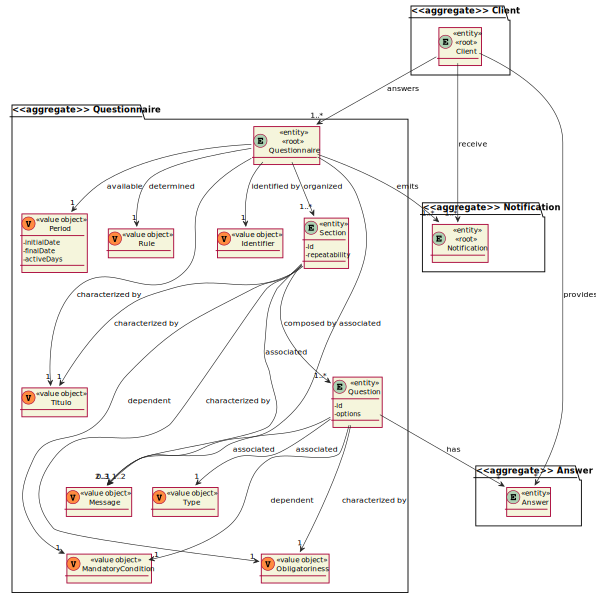

## 2.2 System Sequence Diagram

## 2.3 Explicação da User Story

No processo de criação dos questionários é pedido ao Sales Manager para indicar que critérios se aplicam para identificar que clientes devem responder ao questionário. 
Os diferentes critérios existentes são: 
1. Após a realização de uma encomenda; 
2. Quando o cliente pertence a um determinado intervalo de idades; 
3. Quando o cliente encomenda um determinado produto;
4. Sem restrições.

Depois de o questionário ser validado e ficar registado no sistema as listas dos questionários por responder dos respetivos 
clientes será atualizada para englobar o novo questionário e uma notificação é enviada por email.

O cliente entrando na aplicação tem um menu onde lhe são mostrados os questionários que tem por responder.

Após o cliente selecionar o questionário que pretende responder é então apresentado o questionário ao cliente, começando pelo título e a mensagem 
de boas-vindas vindo a seguir as secções e as respetivas perguntas.

# 3. Design

## 3.1. Realização da Funcionalidade

## 3.2. Diagrama de Classes

## 3.3. Padrões Aplicados

Foram aplicados os princípios SOLID e os padrões de design de software GoF. 

## 3.4. Testes 

**Teste 1:** Verificar que os dias em que o questionário se encontra ativo é determinado corretamente.

    @Test
    public void ensureActiveDays() {
        Calendar initialDate = Calendar.getInstance();
        initialDate.set(2021, 6, 12);
        Calendar finalDate = Calendar.getInstance();
        finalDate.set(2021, 6, 14);Period period = new Period(initialDate,finalDate);
        long result = period.getActiveDays();
        long expected = 2L;
        Assert.assertEquals(expected,result);
    }

# 4. Implementação

## Answer.g4
    
    grammar Answer;

    start: type ;

    type: FREE_TEXT ESPACO frase
    | NUMERIC ESPACO NUMERO+
    | SINGLE_CHOICE ESPACO opcao
    | MULTIPLE_CHOICE ESPACO (opcao)+
    | SINGLE_CHOICE1 ESPACO (opcao|(frase NEWLINE))
    | MULTIPLE_CHOICE1 ESPACO (opcao)+ (frase NEWLINE)?
    | SORTING_OPTIONS ESPACO (opcao)+
    | SCALING_OPTIONS ESPACO (opcao)+
    ;

    frase : ( PALAVRA | NUMERO )+ (VIRGULA? ESPACO (PALAVRA| NUMERO )+)*;

    opcao: alfanumerico NEWLINE;

    alfanumerico: PALAVRA | NUMERO;

    FREE_TEXT: 'Free-Text';
    NUMERIC: 'Numeric';
    SINGLE_CHOICE:'Single-Choice';
    SINGLE_CHOICE1: 'Single-Choice with input value';
    MULTIPLE_CHOICE:'Multiple-Choice';
    MULTIPLE_CHOICE1: 'Multiple-Choice with input value';
    SORTING_OPTIONS:'Sorting Options';
    SCALING_OPTIONS:'Scaling Options';

    NUMERO: [0-9];
    PALAVRA: [a-zA-Z]+;
    VIRGULA: ',';
    ESPACO: ' '|'\t';
    NEWLINE : [\r\n] ;

## AnswersVisitor

    public class AnswersVisitor extends AnswerBaseVisitor<Answer> {

    String aux;
    Answer answer = new Answer();

    @Override public Answer visitStart(AnswerParser.StartContext ctx) {
        visitType(ctx.type());
        return answer;
    }

    @Override public Answer visitType(AnswerParser.TypeContext ctx) {
        if (ctx.FREE_TEXT() != null){
            answer.modifyType("Free-Text");
            visit(ctx.frase());
            answer.addAnswer(aux);
        } else if (ctx.NUMERIC() != null){
            answer.modifyType("Numeric");
            answer.addAnswer(ctx.NUMERO().toString());
        } else if (ctx.SINGLE_CHOICE1() != null){
            answer.modifyType("Single-Choice with input value");
            if (ctx.frase() != null){
                visit(ctx.frase());
                answer.addAnswer(aux);
            } else {
                for (int i = 0; i < ctx.opcao().size(); i++){
                    visit(ctx.opcao(i));
                    answer.addAnswer(aux);
                }
            }
        } else if (ctx.MULTIPLE_CHOICE() != null){
            answer.modifyType("Multiple-Choice");

            for (int i = 0; i < ctx.opcao().size(); i++){
                visit(ctx.opcao(i));
                answer.addAnswer(aux);
            }

        } else if (ctx.SINGLE_CHOICE() != null) {

                answer.modifyType("Single-Choice");

                for (int i = 0; i < ctx.opcao().size(); i++) {
                    visit(ctx.opcao(i));
                    answer.addAnswer(aux);
                }

        } else if (ctx.MULTIPLE_CHOICE1() != null){
            answer.modifyType("Multiple-Choice with input value");

            for (int i = 0; i < ctx.opcao().size(); i++) {
                visit(ctx.opcao(i));
                answer.addAnswer(aux);
            }
            if (ctx.frase() != null) {
                visit(ctx.frase());
                answer.addAnswer(aux);
            }
        } else if (ctx.SCALING_OPTIONS() != null){

            answer.modifyType("Scaling Options");

            for (int i = 0; i < ctx.opcao().size(); i++) {
                visit(ctx.opcao(i));
                answer.addAnswer(aux);
            }
        } else {
            answer.modifyType("Sorting Options");

            for (int i = 0; i < ctx.opcao().size(); i++) {
                visit(ctx.opcao(i));
                answer.addAnswer(aux);
            }
        }

        return answer;
    }

    @Override public Answer visitFrase(AnswerParser.FraseContext ctx) {
        aux = ctx.getText();
        return answer;
    }

    @Override public Answer visitOpcao(AnswerParser.OpcaoContext ctx) {
        visit(ctx.alfanumerico());
        return answer;
    }

    @Override public Answer visitAlfanumerico(AnswerParser.AlfanumericoContext ctx) {
        if (ctx.NUMERO() != null){
            aux = ctx.NUMERO().getText();
        }
        else{
            aux = ctx.PALAVRA().getText();
        }
        return answer;
    }

}

# 5. Integração/Demonstração

Num primeiro momento o cliente procede ao seu login na aplicação.

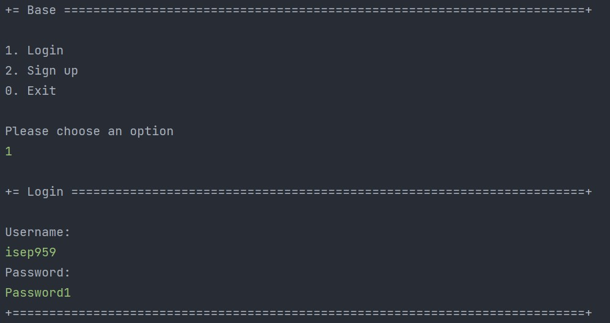

Sendo as diversas opções que ele possuí mostradas de seguida.

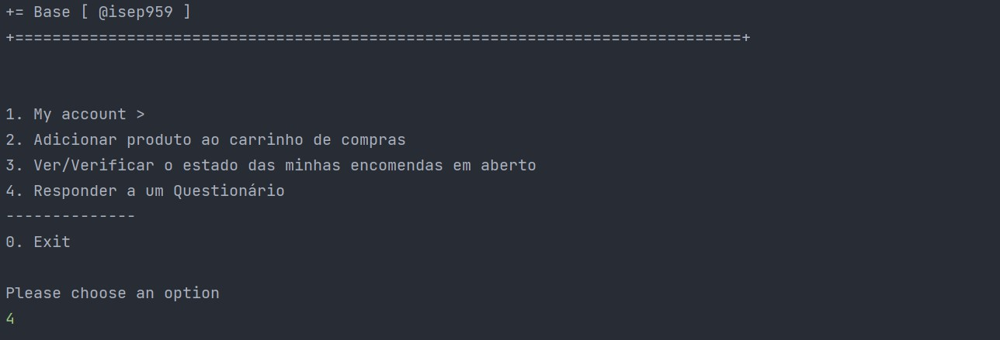

Tendo ele escolhido a opção 4, a opção para responder a um questionário, são lhe apresentados os 
questionários que lhe faltam responder.

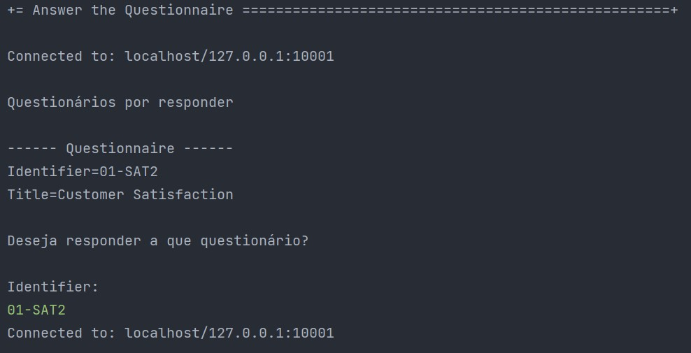

Após ele selecionar o questionário pretendido as diversas perguntas são mostradas e as respostas requisitadas.
Para efeitos demostrativos foi respondida uma pergunta de cada tipo possível.

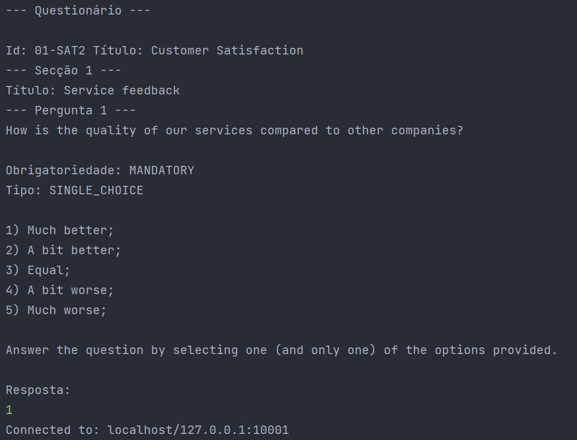
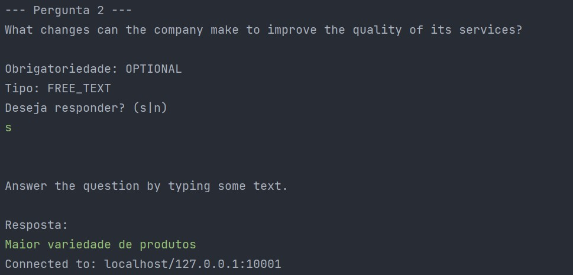
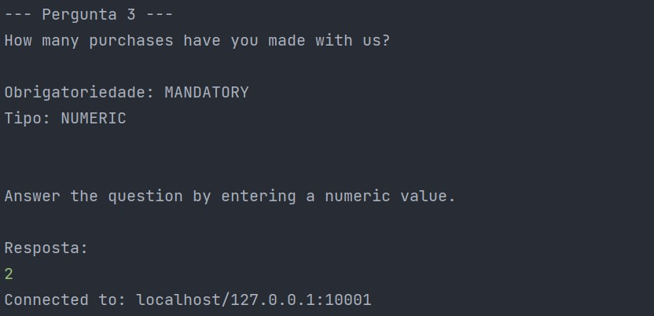
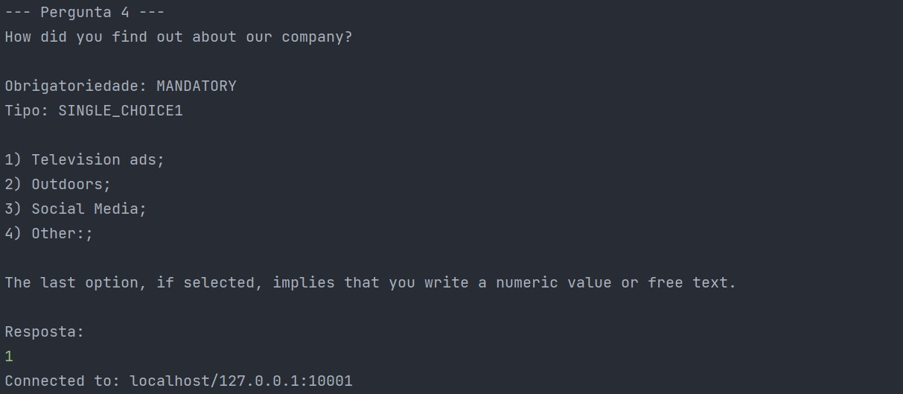
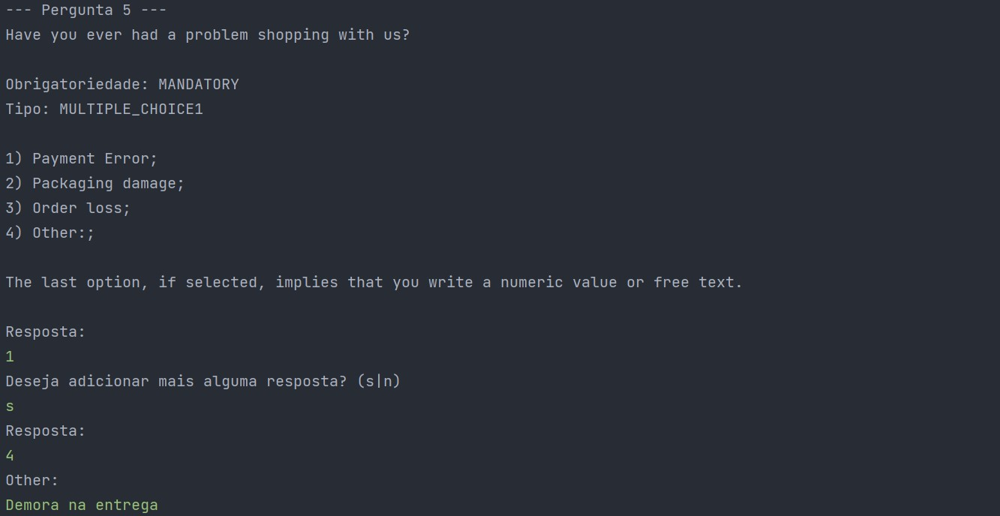
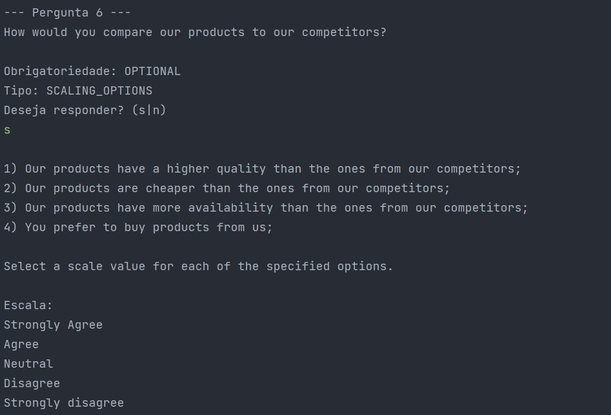
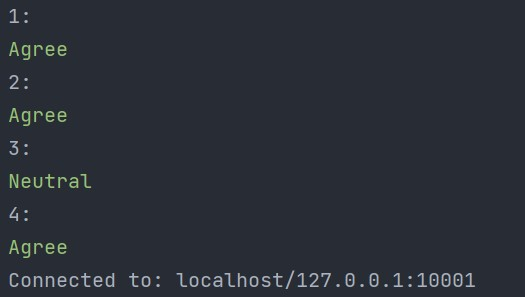
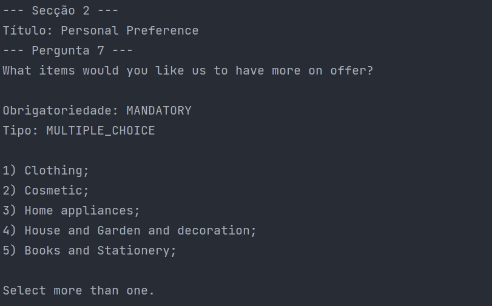
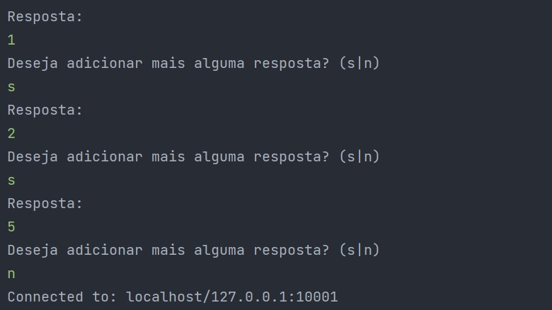
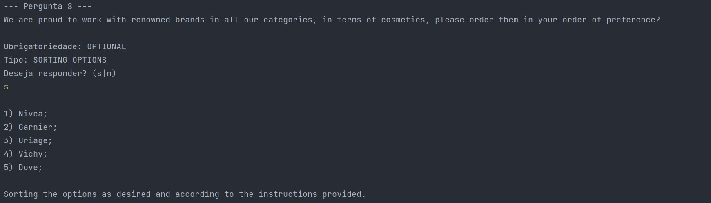
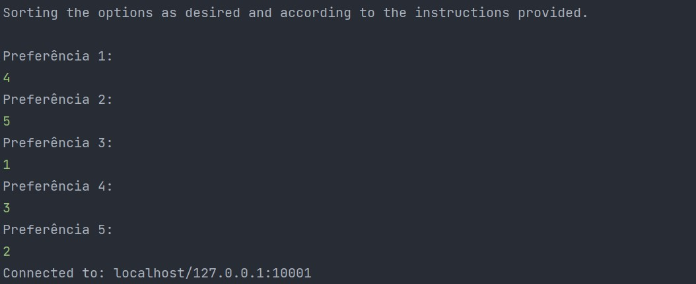

Estas respostas geram as seguintes informções na base de dados:

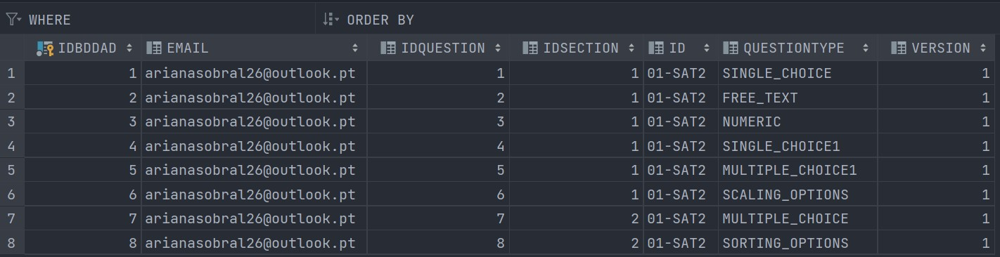
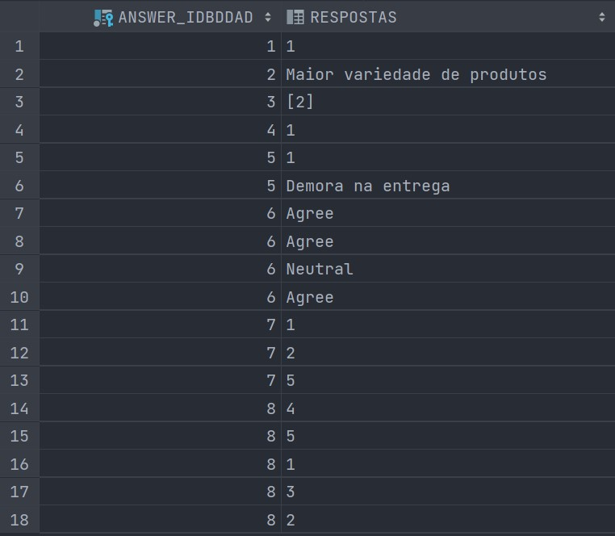

# 6. Observações

A notificação não está a ser enviada por email por questões do gmail ter bloqueado algumas
funcionalidades com aplicativos menos seguros.

